# Docker基础知识
## Docker 是什么？
Docker 是一个开源的应用容器引擎，基于 Go 语言 并遵从 Apache2.0 协议开源。 Docker 可以让开发者打包他们的应用以及依赖包到一个轻量级、可移植的容器中，然后发布到任何流行的 Linux 机器上，也可以实现虚拟化。 容器完全使用沙箱机制，相互之间不会有任何接口，更重要的是容器的性能开销极低。

## Docker 有哪些应用场景？
* Web 应用的自动化打包和发布；
* 自动化测试和持续集成、发布；
* 在服务型环境中部署和调整数据库或其他的后台应用；

## Docker 能为我们带来什么？
1、更快速的交付和部署。使用Docker，开发人员可以使用镜像来快速构建一套标准的开发环境；开发完成后，测试和运维人员可以直接使用相同环境来部署代码。Docker可以快速创建和删除容器，实现快速迭代，大量节约开发、测试、部署的时间。

2、更高效的资源利用。Docker容器的运行不需要额外的虚拟化管理程序支持，它是内核级的虚拟化，可以实现更高的性能，同时对资源的额外需求很低。

3、更轻松的迁移和扩展。Docker容器几乎可以在任意的平台上运行，这种兼容性让用户可以在不同平台之间轻松地迁移应用。

4、更简单的更新管理。使用Dockerfile，只需要修改配置文件，就可以替代以往大量的更新工作。所有修改都以增量的方式进行分发和更新，从而实现自动化且高效的容器管理。

## Docker 的镜像、容器和仓库是什么？

1、Docker的镜像概念类似于虚拟机里的镜像，是一个只读的模板，一个独立的文件系统，包括运行容器所需的数据，可以用来创建新的容器。

2、Docker容器是由Docker镜像创建的运行实例。Docker容器类似虚拟机，可以支持的操作包括启动、停止、删除等。每个容器间是相互隔离的，容器中会运行特定的应用，包含特定应用的代码及所需的依赖文件。

3、Docker 仓库是用来存储镜像的位置，Docker提供一个注册服务器（Register）来保存多个仓库，每个仓库又可以包含多个具备不同tag的镜像。Docker运行中使用的默认仓库是 Docker Hub 公共仓库。

# 在用友云开发者中心使用 Docker
## 如何在用友云开发者中心获取一个 Docker 镜像？
为了帮助国内的开发者更方便地使用 Docker 镜像，用友云开发者中心提供了部分最常使用的镜像，均是从 Docker Store同步过来，可以供用户直接部署。用户注册登录用友云开发者中心后，在 `镜像仓库` -> `公有仓库` 中寻找自己所需的镜像，点击所需镜像图标，进入镜像详情页，可以看到该镜像的详细介绍，点击 `部署` 按钮，来到镜像部署详情页，填写、选择相关信息，部署即可。

对于用友云开发者中心中没有提供的镜像，用户可以使用 `docker pull` 命令从网络上下载镜像，该命令的格式为：`docker pull image_name[:tag]`。对于Docker镜像来说，如果不显式地指定tag，那默认会选择latest标签，即下载仓库中最新版本的镜像。例如，从 `docker store` 上拉取CentOS镜像：`sudo docker pull centos`。

## 如何在用友云开发者中心中启动一个 Docker 容器？
注册登录用友云开发者中心后，在 `应用管理` 中，点击 `创建新应用`，

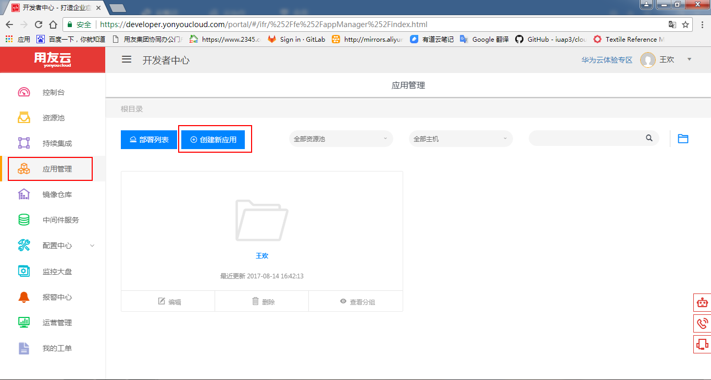

 图 1

填写待填写信息

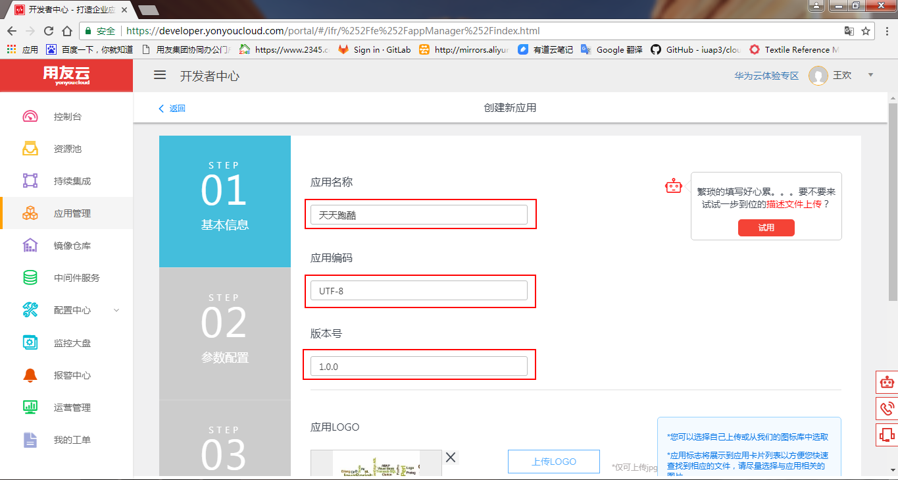

 图 2

上传LOGO，填写应用描述，进入 `下一步` 

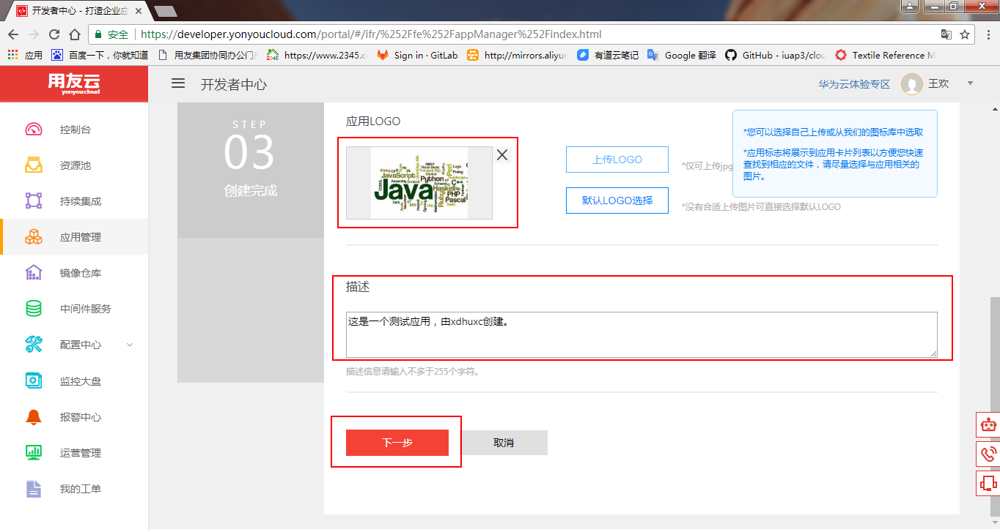

 图 3

选择自己项目的 `应用类型` ，然后根据提示上传应用文件，填写自己应用的镜像名称

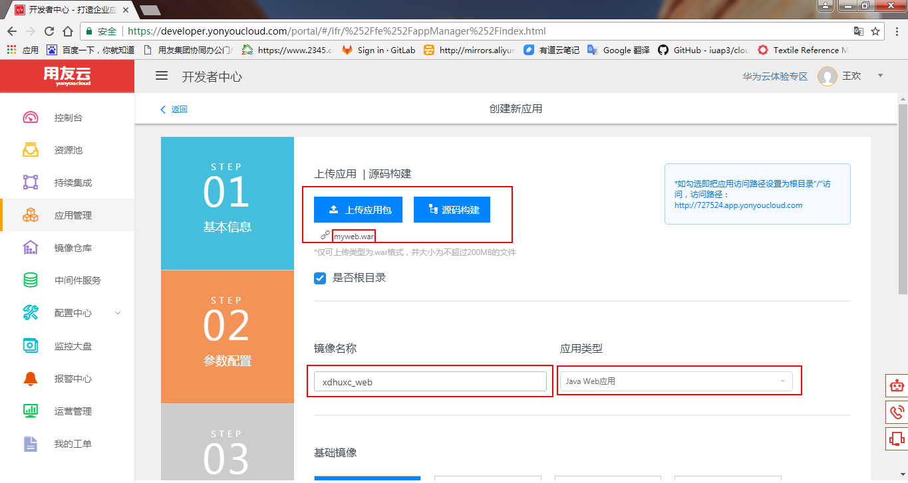

 图 4

选择`基础镜像` 和 `发布应用镜像`，然后点击 `创建`

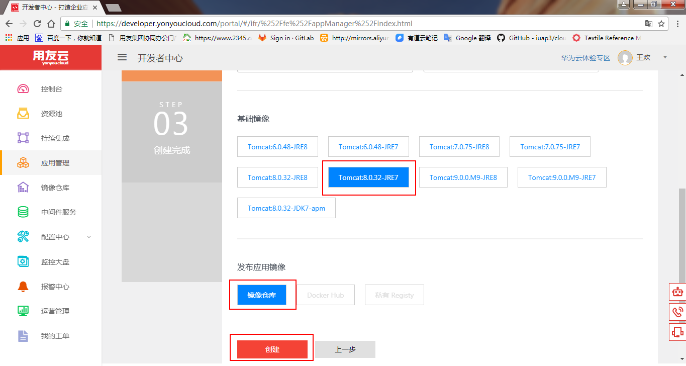

 图 5

应用创建完成

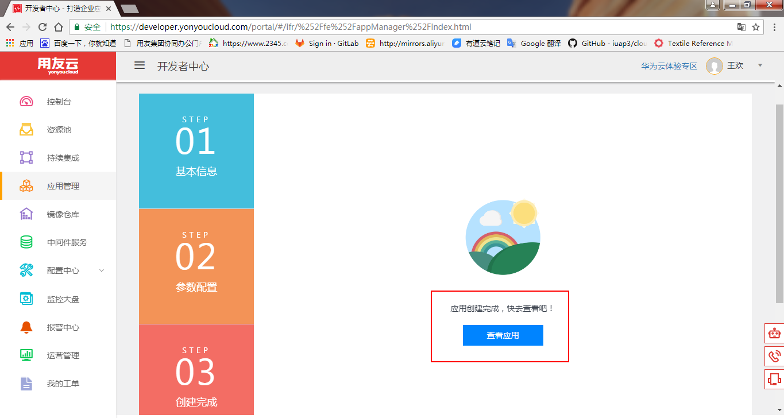

 图 6

点击`查看应用`，即可看到镜像构建过程中的日志输出

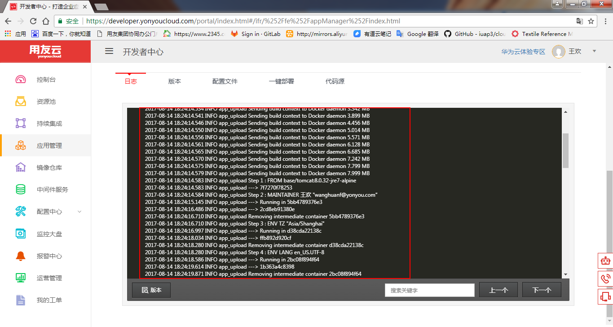

 图 7

镜像构建成功
点击`查看应用`，即可看到镜像构建过程中的日志输出

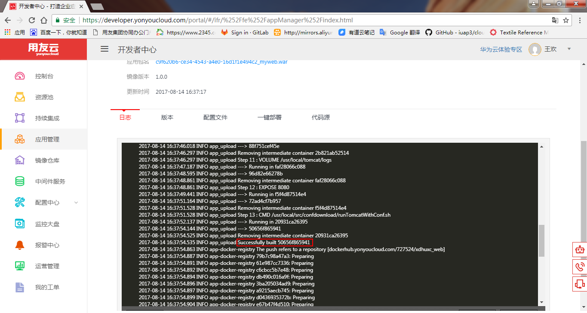

 图 8

镜像成功上传至镜像仓库

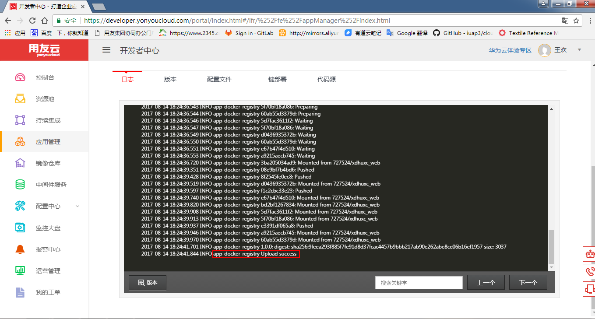

 图 9

刚构建好的镜像处于 `待部署` 状态，点击 `部署` 按钮部署镜像

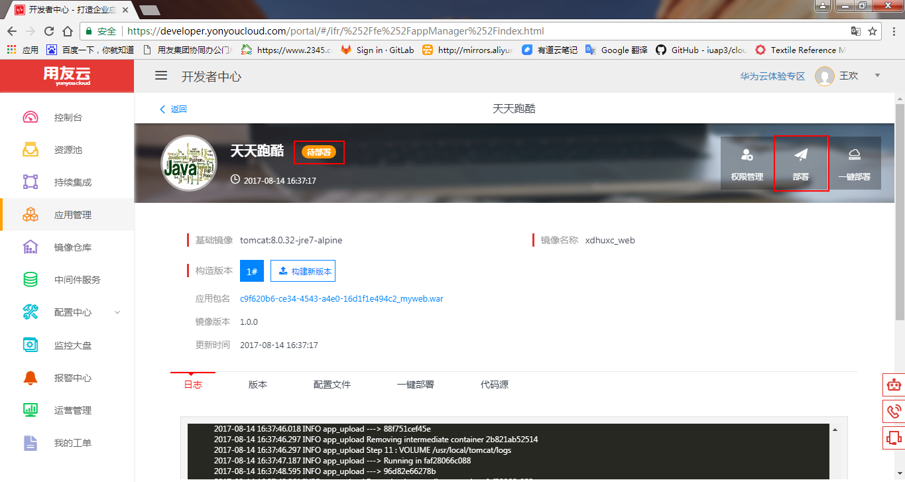

 图 10

选择资源池，设置内存、CPU、磁盘大小和实例个数，点击 `部署` 即可

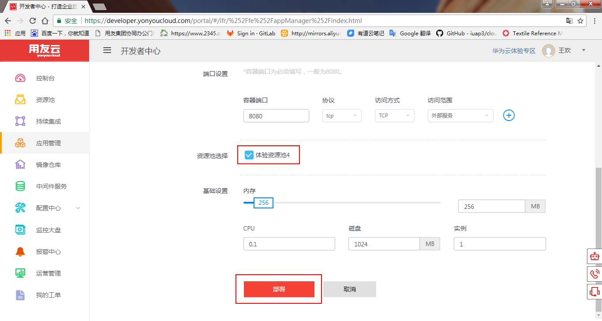

 图 11

应用部署成功

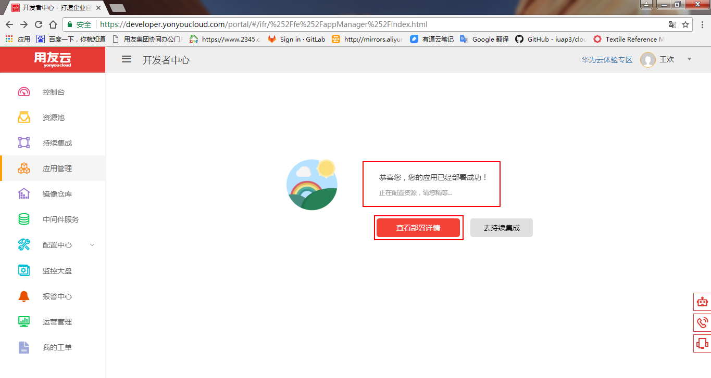

 图 12

查看部署详情，应用部署完毕。

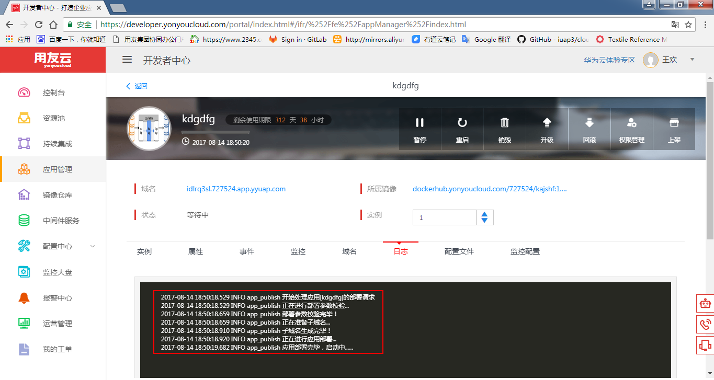

 图 13

## 在用友云开发者中心，如何停止一个正在运行的Docker容器？
在自己部署的应用详情页，点击`暂停`，即可停止正在运行的应用容器

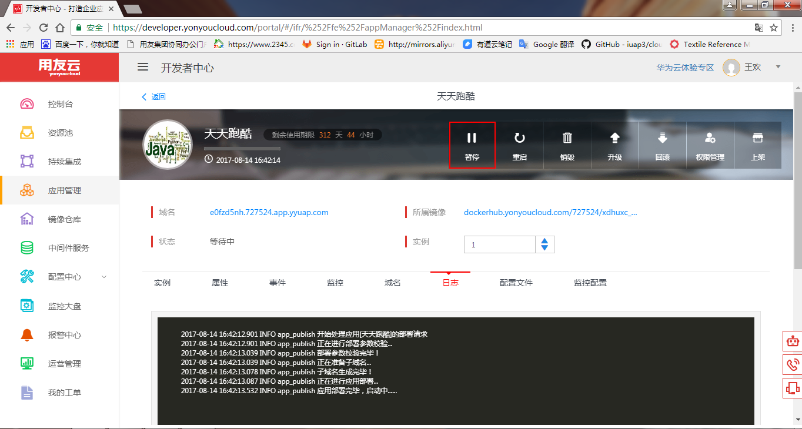

 图 14

## 在用友云开发者中心，如何删除一个 Docker 容器？
在自己部署的应用详情页，点击 `销毁`，即可销毁正在运行的应用容器

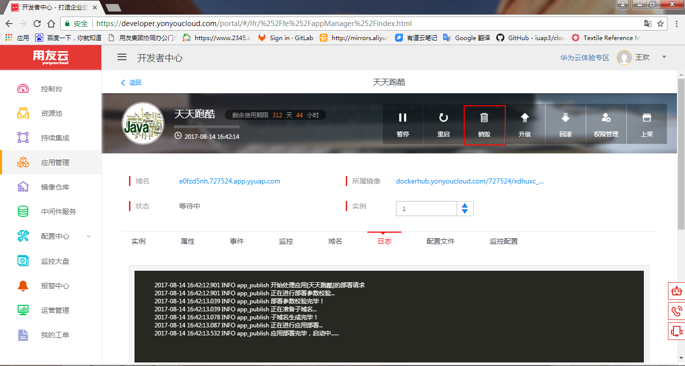

 图 15

