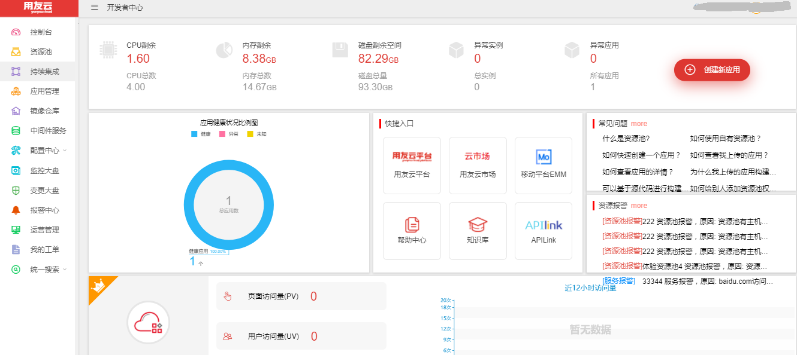
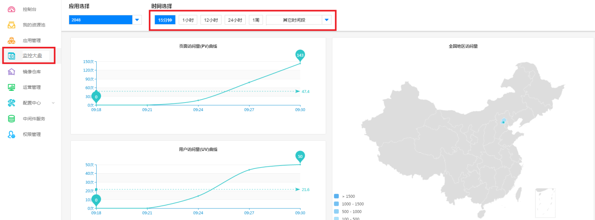

# 云开发者中心快速入门

第一步：登录云开发者中心网站：https://developer.yonyoucloud.com

图 1

第二步：申请体验资源池

单击侧边栏的“我的资源池”，进入体验资源池界面。体验资源池是给服务商分配的资源池。

1、点击〖申请体验资源池〗按钮。

图 2

2、输入邀请码，创建资源池。

图 3

如果没有邀请码，点击〖去申请〗申请邀请码。填写申请信息：

图 4

完成填写后，点击〖申请邀请码〗，等待管理员审核。收到系统发送的邀请码后，录入即可。

控制台正常界面显示如下：

图 5

第三步：创建应用

[点击查看如何快速创建一个应用](articles/developer/4-/scene1.md)

第四步：部署应用

[点击查看如何快速部署应用](articles/developer/4-/scene2.md)

第五步：监控大盘

点击侧边栏的“监控大盘”，查看地域分布图，可以根据不同时间段做查询。如下图：

图 6

图 7

第六步：应用上架

点击“应用管理”，选择进入一个应用，点击右上角〖上架〗进入商品上架界面。首先填写接入信息，带*号内容为必填，然后点击〖下一步〗：

图 8

填写商品基本信息，点击〖下一步〗：

图 9

填写商品版本规格，点击〖下一步〗：

图 10

填写资质与案例，点击〖下一步〗：

图 11

最后，填写售后支持信息。然后点击〖提交〗。

图 12

提交后，等待管理员审核。审核通过后就可以将应用放到云市场上售卖。

图 13

