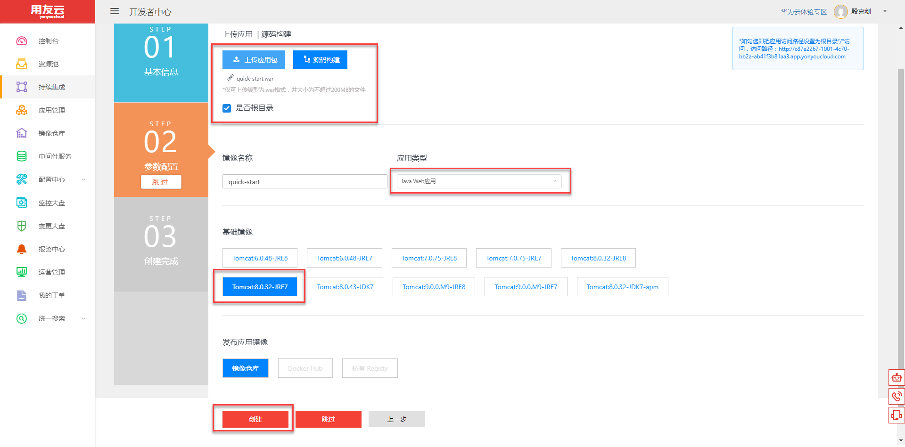
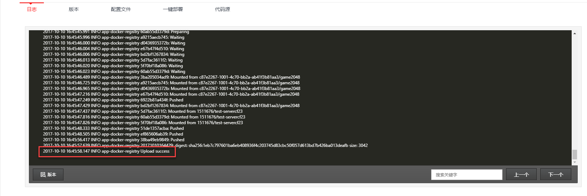
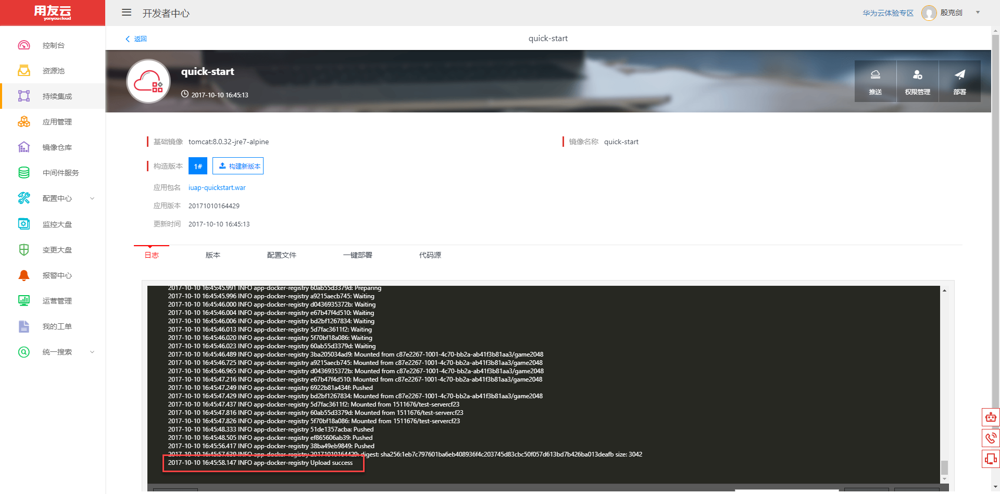

# 如何快速创建一个应用 

第一步：点击左侧“持续集成”或者“应用管理”，左上角点击“创建新应用”的按钮。

图 1

第二步：按要求填写所有的文本框；选择对应的应用分类以及运行环境，并上传对应格式的应用包。

图 2

图 3

第三步：点击最下面的“创建新应用”，可以查看当前日志，等待出现“Upload success”，镜像封装完成

图 4

我们还可以点击“构建新版本”来更新应用程序,只需填写新的版本号并上传新应用即可，如下图所示。

图 5

