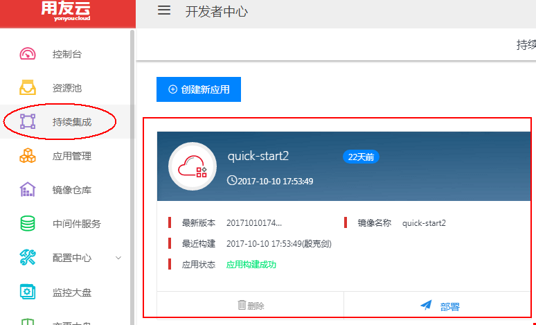
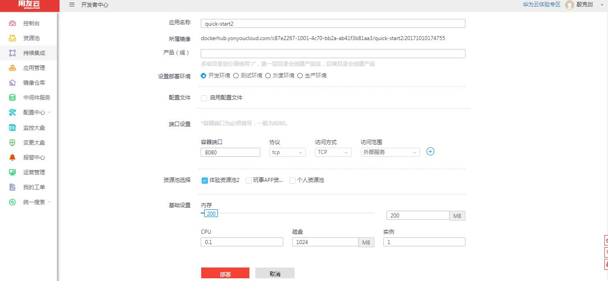

1分钟快速部署您的第一个容器
=
第一步：在持续集成中找到您已经构建成功的应用，点击“部署”，进入部署界面
（通过`镜像仓库` 的入口也可以进入部署界面）。

图 1

第二步：按需求填写端口设置，然后选择资源池，再对内存、cpu权重、磁盘大小和实例数量进行设置，完成之后点击“部署”。

图 2

图 3

第三步：查看部署详情，当显示状态是运行中，那么应用实例就启动成功了。我们可以点击域名来访问我们部署的应用容器。

图 4

图 5
