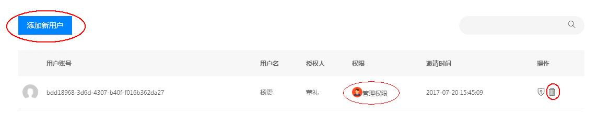
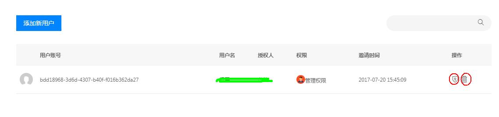

# 权限管理

## 一、菜单授权（只有管理员可以操作）
### 授权
    服务商的员工注册用友云用户后,管理员可以为员工授予开发者中心的权限,员工登录后就可以进行该项功能的管理;

- 点击左侧导航中的权限管理.左侧菜单列表中显示的是到可分配的菜单

图 1

- 选择一个菜单,可以在右侧用户列表界面看到有此菜单权限的用户.

图 2

- 点击"用户"右侧的"+"图标,会出现选择员工的输入框

图 3

- 输入框内输入员工的注册账号(支持 姓名 账号 手机号码 邮箱模糊匹配)  

图 4

- 查找到员工信息后 点击手机号后面的复选框

图 5

- 点击授权按钮,完成授权.

图 6

### 取消授权
在列表右侧点击删除图标,可以删除该项授权.

图 7

====================================

二、其他授权管理
-
点击对应授权按钮后，就可以看到已授权用户的信息，图8中显示没有已授权的用户。

图 8

可以点击“添加新用户”来增加目标用户的权限，在搜索栏搜索目标用户，选中目标用户后，选择对应权限，点击“授权”即可完成授权。

图 9

然后就可以看到已授权用户的情况，可以在“操作”栏里对用户的权限进行修改，以及删除授权用户。

图 10

