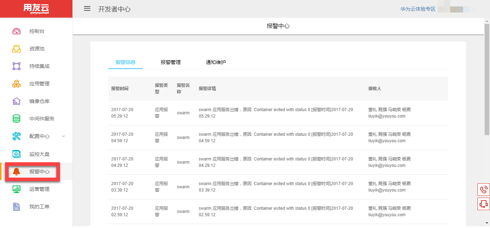
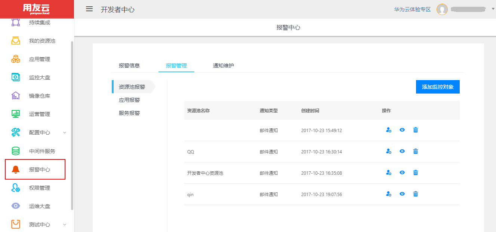
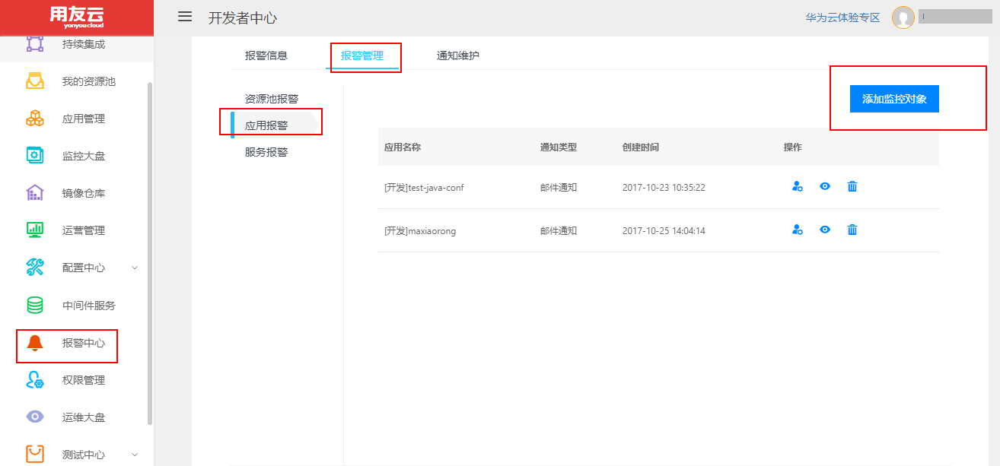
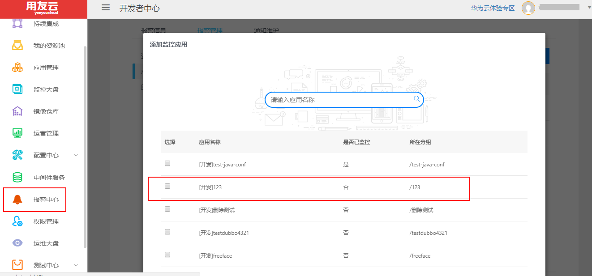
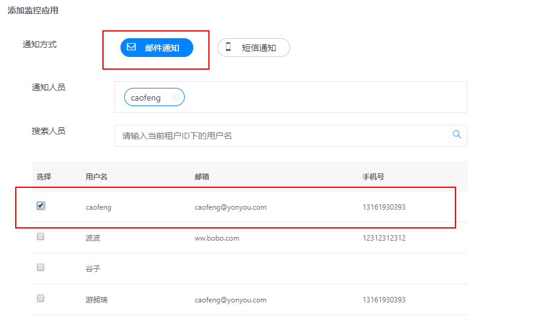
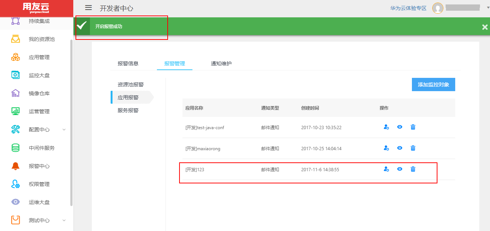
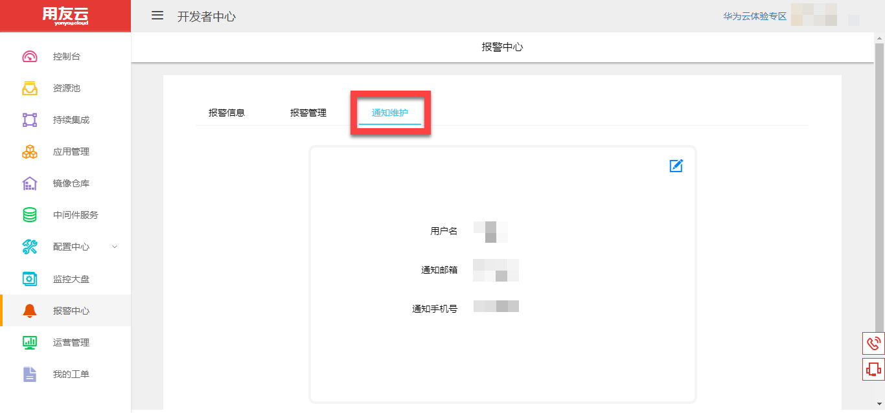

# 报警中心

报警中心可以将**资源池**以及**应用**的问题，通过邮件或者短信，及时发送给用户。

1.单击左侧菜单栏的【报警中心】，进入【报警中心】页面，如图1所示。

图 1

2.在【报警管理】页签可以设置报警类型，设置报警对象等，如图2所示。

图 2

&ensp;&ensp;&ensp;&ensp;接下来以应用【123】为例，介绍如何设置报警管理。

&ensp;&ensp;&ensp;&ensp;(1)点击左侧的【应用报警】，进入应用报警页签，点击【添加监控对象】，如图3所示。

图 3

&ensp;&ensp;&ensp;&ensp;(2)选择应用【123】，并点击【下一步】，也可以选择多个未开启报警的应用一起开启报警，但是请注意，如果应用已经开启报警则不能重复添加报警，否则会导致批量选择的应用全部开启报警失败。如图4所示。

图 4

&ensp;&ensp;&ensp;&ensp;(3)选择通知方式，通知人员等信息，点击【开启报警】，如图5所示。

图 5

&ensp;&ensp;&ensp;&ensp;(4)应用【123】的报警开启成功，如图6所示。

图 6

3.在【通知维护】页签可以设置邮箱和手机号，以便报警信息及时发送给用户，如图7所示。

图 7

