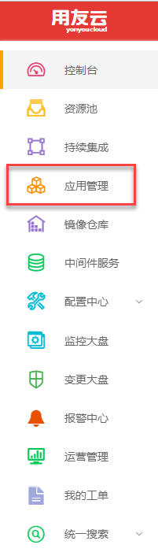
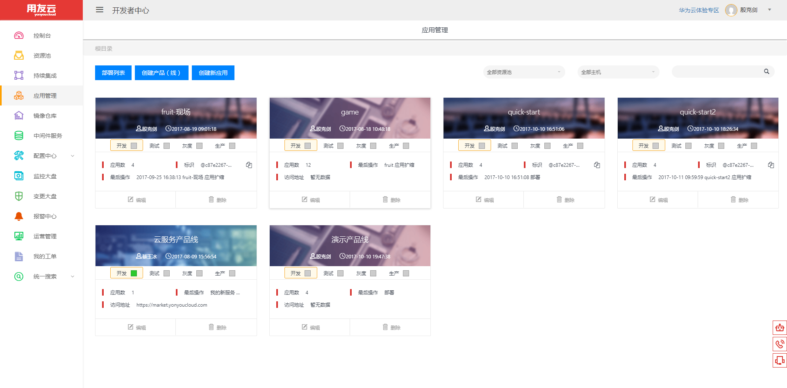
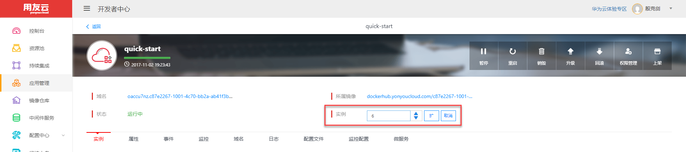
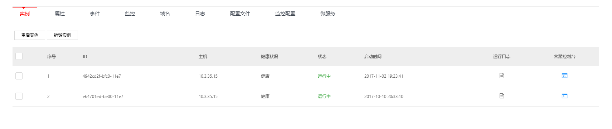
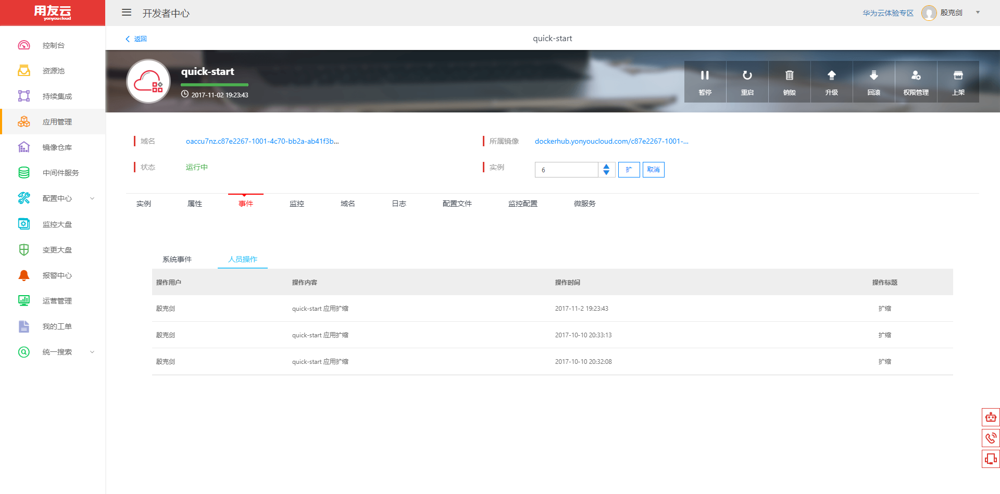
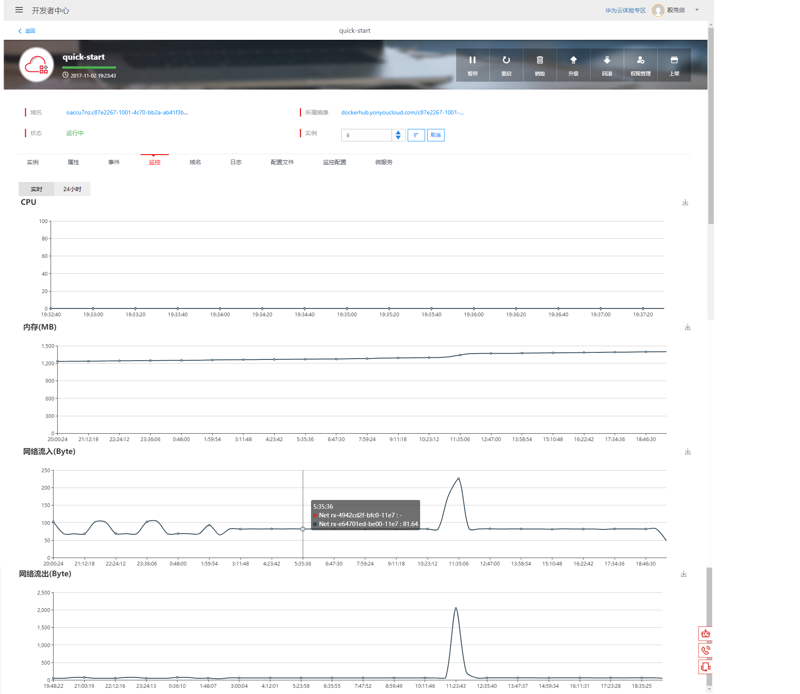
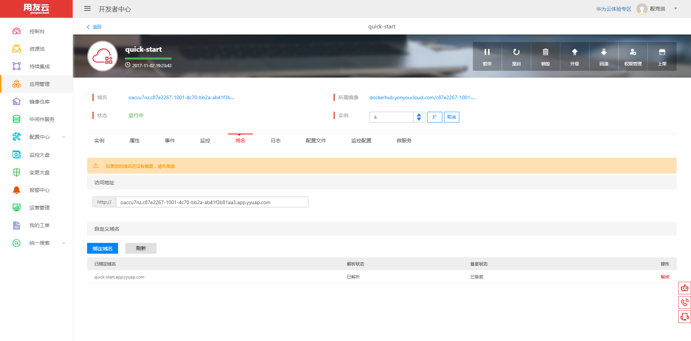
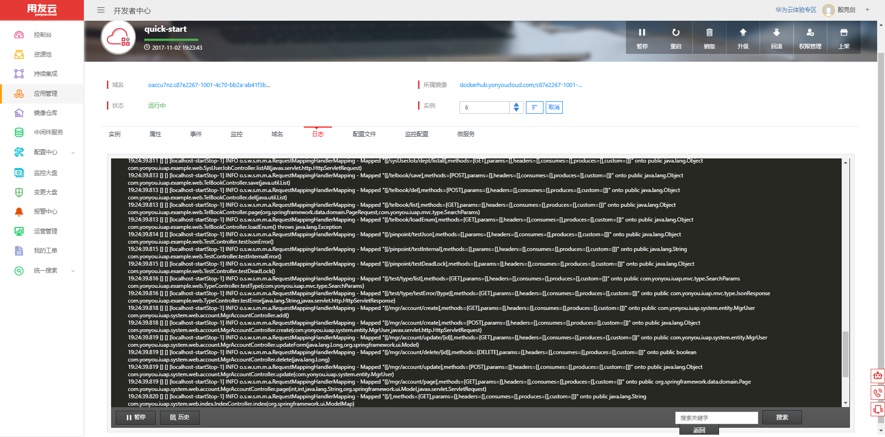
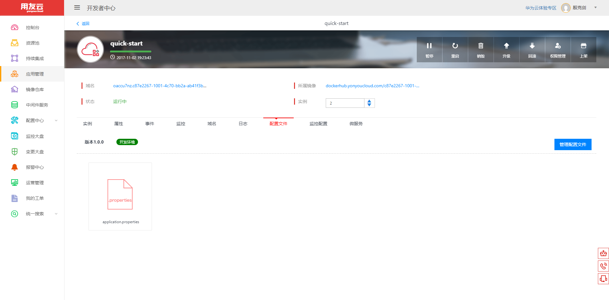

# 概述

用友云开发者中心的应用管理提供了对已部署应用的管理，包括应用的启动、暂停、销毁、升级、回滚以及扩缩等。

## 应用管理入口

在开发者中心菜单栏点击应用管理即可进入应用管理页面，如下图所示。

图 1

## 应用列表

进入应用管理菜单后，可以查看已部署的应用列表，支持通过资源池、主机等过滤。每一个应用都展示了一些基本信息。点击应用，可进入应用详情页，可进行应用的销毁，如下图所示。

图 2

## 应用详情

1.在应用详情页，显示了应用的域名、镜像、创建时间等；同时提供了暂停、重启、销毁、升级、回滚、上架等功能，如下图所示。

> 暂停：将应用暂停，这时应用的实例数变为0。
> 
> 重启：将应用的所有实例重启，先启动相同的实例数，健康后销毁旧的实例，实现蓝绿切换。
> 
> 销毁：删除应用，将应用完全销毁。
> 
> 升级：更新应用。
> 
> 回滚：如果当前版本有问题，可以回滚到旧的版本
> 
> 上架：上架应用

图 3

2.扩缩

修改应用的实例数来应对不同的访问，如下图所示。

图 4

3.`实例`页签

实例页签列出了所有正在运行的实例，包括实例的运行状态、健康情况，以及运行的主机等；支持特定实例的销毁、日志查看等功能，如下图所示。

图 5

> `重启`实例

*选择实例后，点击`重启`按钮，即可删除当前实例并重新启动一个新的实例.*

> `销毁并缩容`

*选择实例后，点击`销毁`按钮，即可删除当前实例，并不会再启动新的实例.*

> 点击运行日志的图标，可以查看当前实例的运行日志。
> 
> 点击容器控制台的图标，会打开一个控制台页面，可以对容器进行操作。

4.`属性`页签

属性页签可以修改部署应用的属性，包括cpu、内存、镜像、健康检查等，如下图所示。

图 6

5.`事件`页签

事件页签显示了最后修改、失败任务等，如下图所示。

图 7

6.`监控`页签

监控页签显示了每个实例的cpu、内存、网络的图表信息，可以查看实时和24小时的图表信息，如下图所示。

图 8

7.`域名`页签

域名页签显示了应用的域名，并可以绑定新的域名，如下图所示。

图 9

8.`日志`页签

日志页签可以查看应用的日志，并可以暂停日志刷新，如下图所示。

图 10

9.`配置文件`页签

配置文件页签可以查看、管理该应用的配置文件，如下图所示。

图 11
