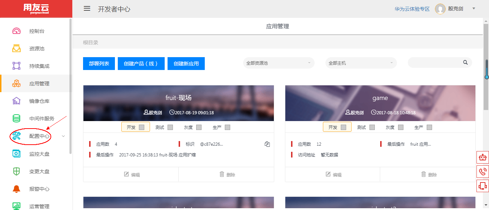
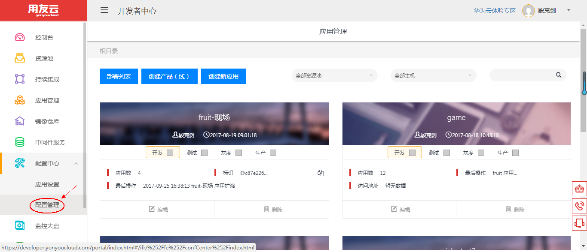
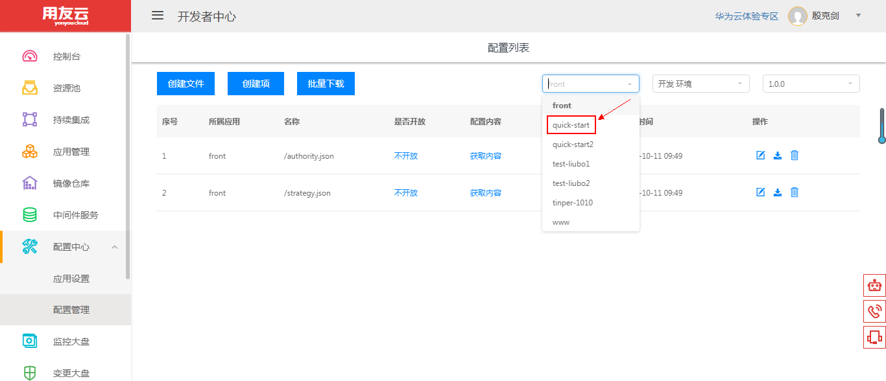
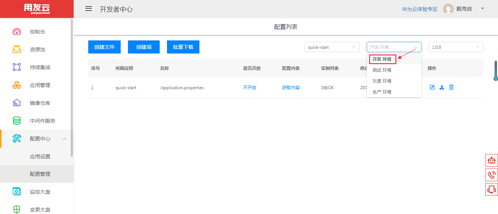
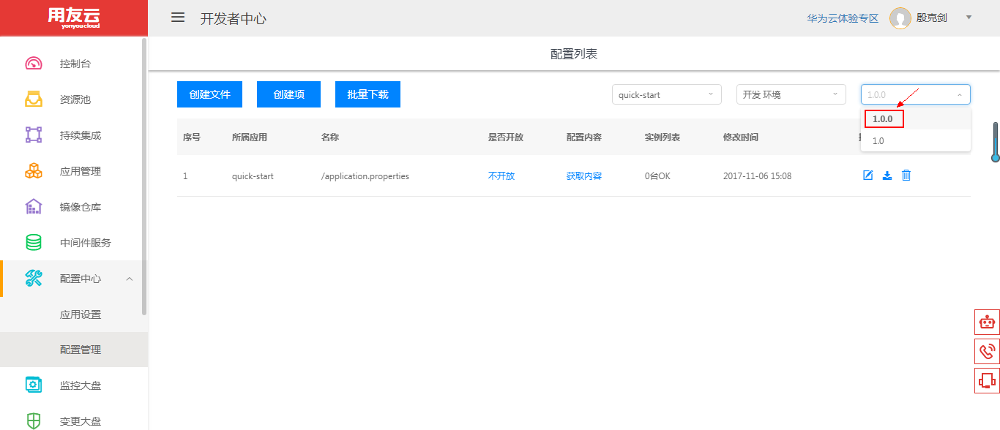
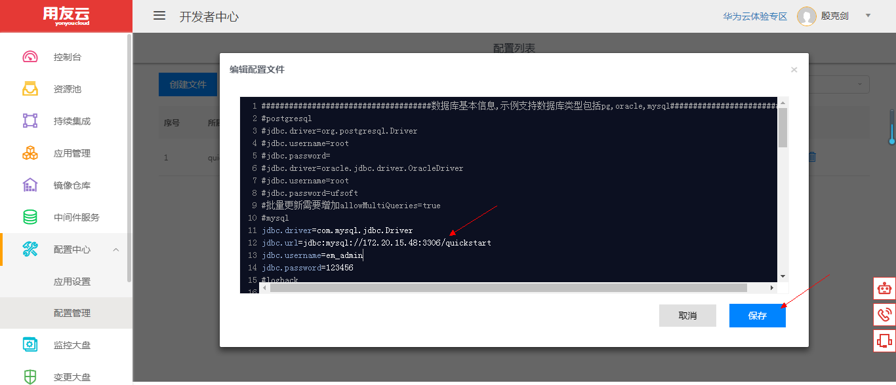
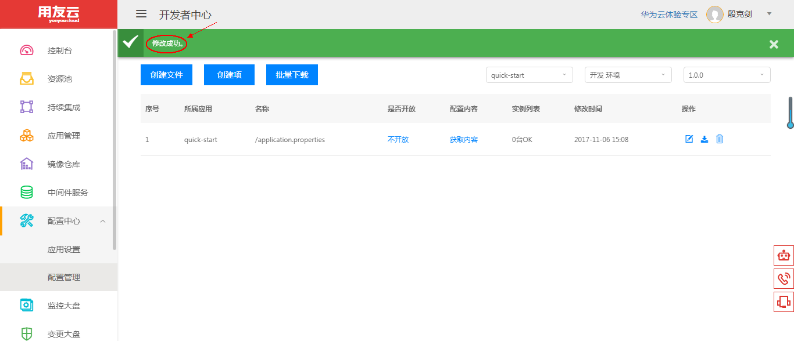

# 配置中心

## 配置中心简介 

用友云开发者中心的配置中心为用户的应用程序提供统一的配置管理，用户可以根据自己的需要在线修改应用的配置文件中的参数及参数值并保存，然后重新启动应用，可将修改后的配置参数应用到自己的应用程序中去。

## 配置中心使用说明

1、登录用友云开发者中心官网，[点击这里](https://developer.yonyoucloud.com)。

2、点击左侧菜单 `配置中心` 。

图 1

选择 `配置管理`。

图 2

3、选择待修改应用的名称。

图 3

选择应用所在环境。

图 4

选择待修改应用的版本。

图 5

4、点击下图中红色方框区域。

图 6

在弹出来的 `编辑配置文件` 对话框中，修改配置文件中的参数或参数值，点击 `保存` 按钮保存修改。

图 7

配置文件修改成功。

图 8

