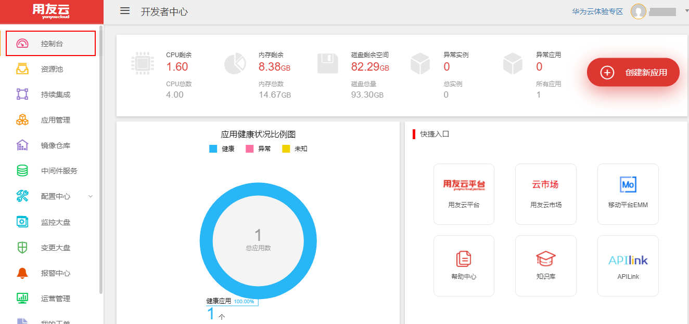
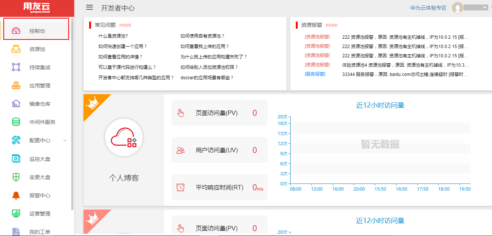
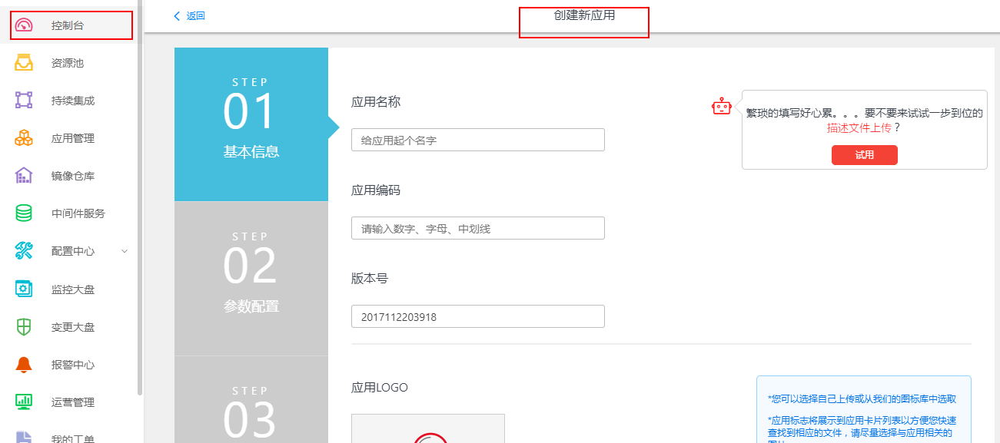
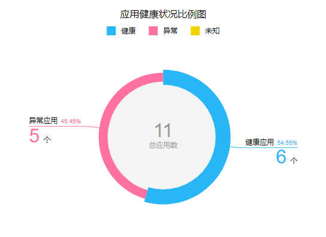
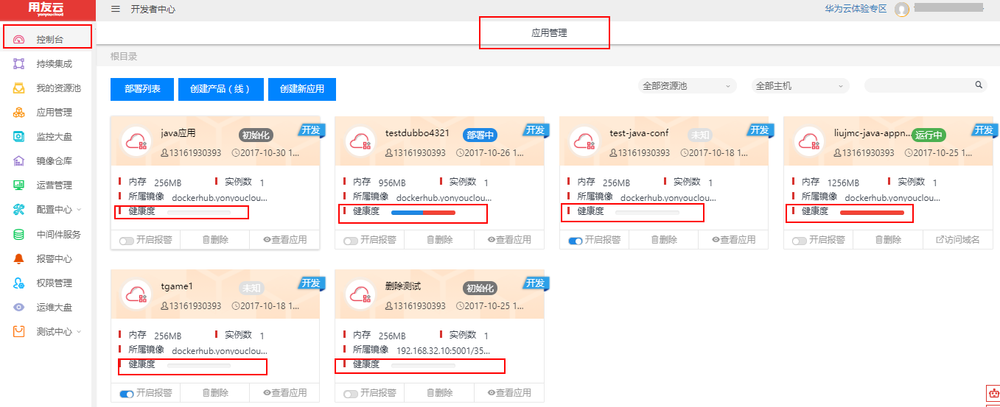
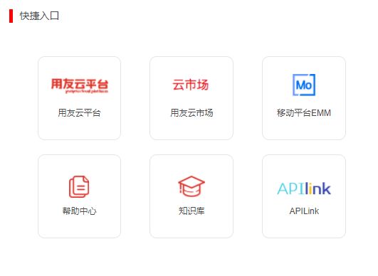
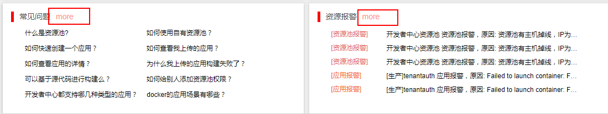
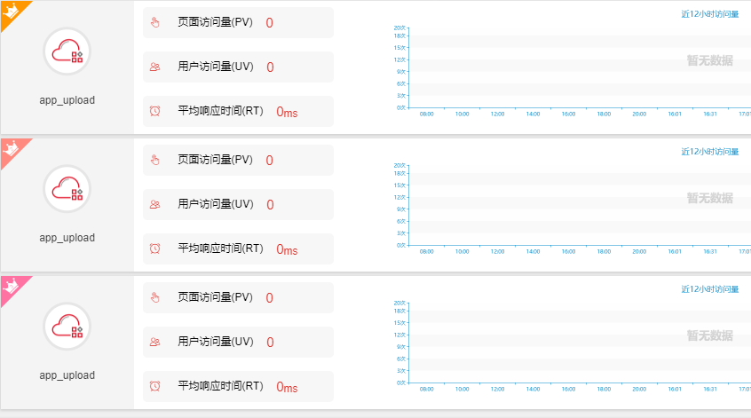

### 概述
控制台，是对开发者中心资源、应用健康状况、应用访问情况的概览中心，还提供了相关帮助文档以及其他协同部门的快捷链接入口，方便用户总体把控资源应用的调度和使用情况。如图1.1和图1.2所示。

 图 1-1

 图 1-2

下面对控制台各部分功能进行详细介绍。

最上方是用户所在资源池的资源和应用的概览情况，包括CPU、内存、磁盘、实例、应用的总体情况，右侧是创建新应用的快捷入口，点击即进入如图2和图3所示。

 图 2

 图 3

图4是改用户账号下所有应用数以及应用的健康状况预览图，其中蓝色代表健康，红色表示异常，黄色表示未知状况。

 图 4

点击异常应用，可链接到应用管理中查看异常应用的详细情况，如图5所示。

 图 5

图6所示为相关协同部门和帮助文档的快速链接

 图 6

图7左侧所示为用户使用开发者中心时经常遇到的问题，点击每个问题可以看到相应答案，点``more``查看更多问题，想要查看全部帮助文档可以点击图5所示的``帮助文档``，获取开发者中心的使用手册。右侧为应用的报警信息，方便用户直接查看。

 图 7

图8所示为用户所有应用中访问量最多的前三个应用，即top3。

 图 8
