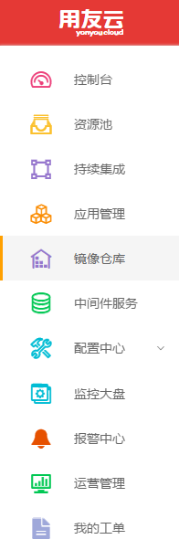
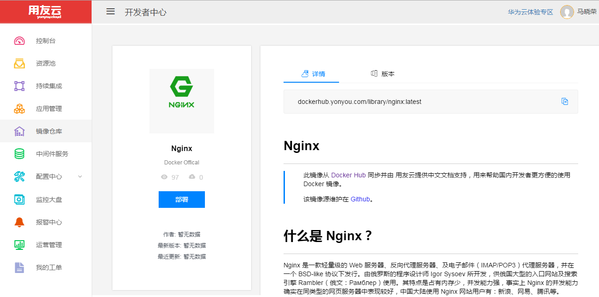
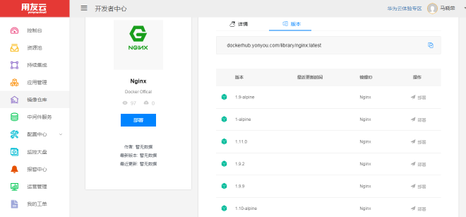
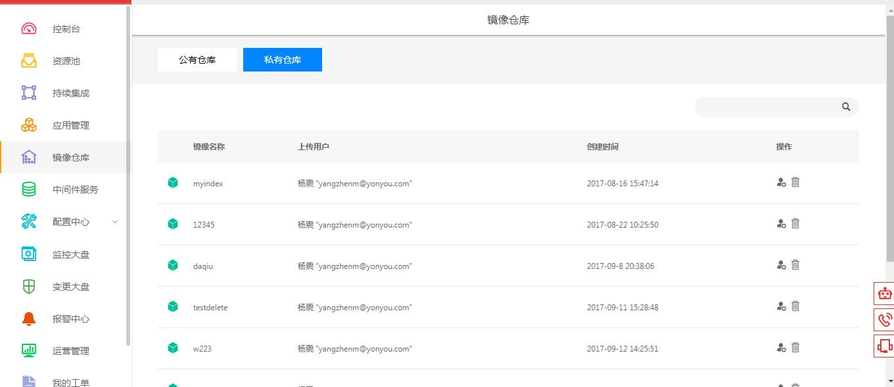
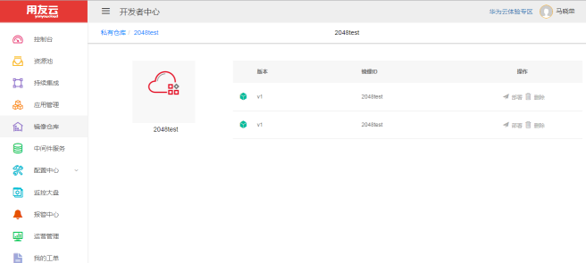
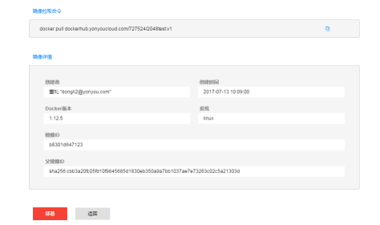
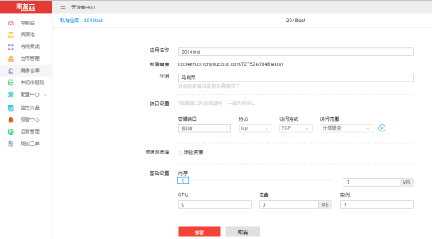

## 概述
用友云开发者中心的镜像仓库节点提供了对已上传应用```docker```镜像的浏览和管理，集成了公有镜像仓库以提供常用的的```docker```镜像供开发者使用。

## 镜像仓库入口
从开发者中心菜单栏点击镜像仓库即可进入镜像仓库节点，进入后默认展示的是公有镜像仓库。如图1所示。
<div align="center">

</div>
<p align="center"> 图 1</p>


## 公有镜像仓库
> 开发者中心提供的公有镜像仓库对开发者常用的镜像进行了集成，如nginx,tomcat,Alpine Linux等。开发者可以便捷的从开发者中心的公有镜像仓库中进行pull操作或直接部署公有镜像至资源池中。

如图2所示。

<div align="center">

</div>
<p align="center"> 图 2</p>

### Pull公有镜像
如果开发者需要从用友云开发者中心中Pull镜像，则需要先找到镜像的类目，比如```nginx```,镜像信息页面会展示镜像的相关描述，包括最新版本Pull命令和镜像的概述。如图3所示。

<div align="center">

</div>
<p align="center"> 图 3</p>

使用页面上的```dockerhub.yonyou.com/library/nginx:latest```就可以完成镜像的拉取动作。
完整示例：
```
docker pull dockerhub.yonyou.com/library/nginx
Using default tag: latest
Trying to pull repository dockerhub.yonyou.com/library/nginx ... 
latest: Pulling from dockerhub.yonyou.com/library/nginx
Digest: sha256:41ad9967ea448d7c2b203c699b429abe1ed5af331cd92533900c6d77490e0268
```

### 部署公有镜像
开发者可以将公有镜像仓库中的镜像直接部署到资源池中，比如需要使用```nginx```服务，则可以从公有镜像仓库中的```nginx```类目下找到需要部署的镜像版本，点击部署并进行相应配置进行发布，即可得到可用的```nginx```容器。
镜像版本列表如图4所示。

<div align="center">

</div>
<p align="center"> 图 4</p>

镜像部署相关配置参见[应用部署](articles/developer/4-/scene2.md)。

## 私有镜像仓库
> 开发者中心的私有镜像仓库保存的是用户所属租户所上传的镜像，是开发者进行自有应用docker镜像管理的节点，在私有镜像仓库中开发者可以进行镜像的浏览、删除，并且可以从镜像仓库进行应用镜像的部署。

### 私有镜像管理
进入私有镜像仓库页签，页面将展示开发者所属租户的所有根据已上传应用生成的```docker```镜像分类(镜像的```name```属性)。
如图5所示。

<div align="center">

</div>
<p align="center"> 图 5</p>

查找并点击要查看的镜像类目，页面将展示该镜像的所有版本(镜像的```tag```属性)。
如图6所示。

<div align="center">

</div>
<p align="center"> 图 6</p>

点击需要查看的镜像版本，可以查看到镜像的ID、创建者、创建时间等具体信息。
如7图所示。

<div align="center">

</div>
<p align="center"> 图 7</p>

### 私有镜像部署
在镜像明细页面，可以进行应用镜像的部署。开发者填写应用启动的相关配置参数，即可快速完成镜像的部署动作。
如图8所示。

<div align="center">

</div>
<p align="center"> 图 8</p>

镜像的部署配置可以参见[应用部署](articles/developer/4-/scene2.md)章节。

### 手动上传镜像至私有镜像仓库
用友云开发者中心在私有镜像仓库为开发者提供了手动上传镜像功能，开发者可以通过Push脚本进行自有```docker```镜像的上传。

开发者上传的镜像名需要遵循以下规则:
```
dockerhub.yonyoucloud.com/租户ID/imagename:tag 
```
**如果是当作自定义基础镜像，规定在imagename后边加上_ownbase后缀，例如：dockerhub.yonyoucloud.com/租户ID/imagename```_ownbase```:tag*

将镜像  tag 为符合规则的镜像名后，开发者先登录到私有镜像仓库，然后进行Push动作，完成Push后即可在开发者的私有镜像仓库中查看到手动上传的镜像信息。

完整示例:
```
docker tag dockerhub.yonyou.com/library/nginx:latest dockerhub.yonyoucloud.com/727524/nginx:v1
docker login dockerhub.yonyoucloud.com
Username (开发者登录帐号)
Password: (开发者登录密码)
Login Succeeded
docker push dockerhub.yonyoucloud.com/727524/nginx:v1
The push refers to a repository [dockerhub.yonyoucloud.com/727524/nginx]
08e6bf75740d: Layer already exists 
f12c15fc56f1: Layer already exists 
8781ec54ba04: Layer already exists 
v1: digest: sha256:12d30ce421ad530494d588f87b2328ddc3cae666e77ea1ae5ac3a6661e52cde6 size: 948
```

Tips: 租户ID可以联系开发者中心获取。
