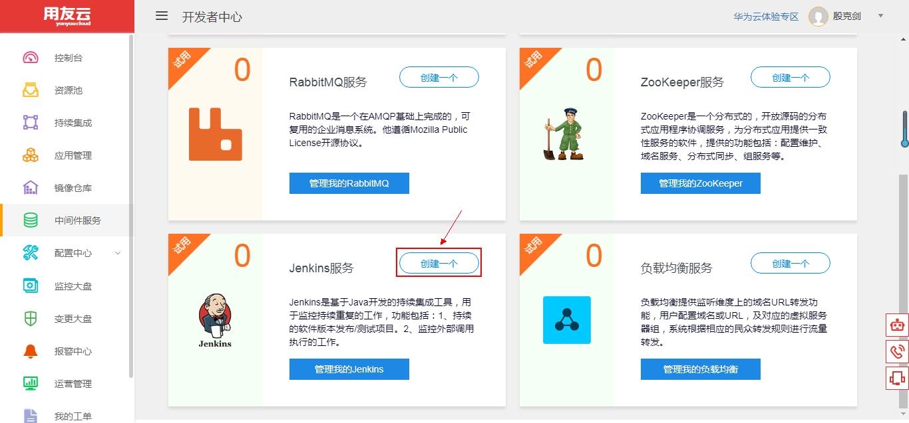
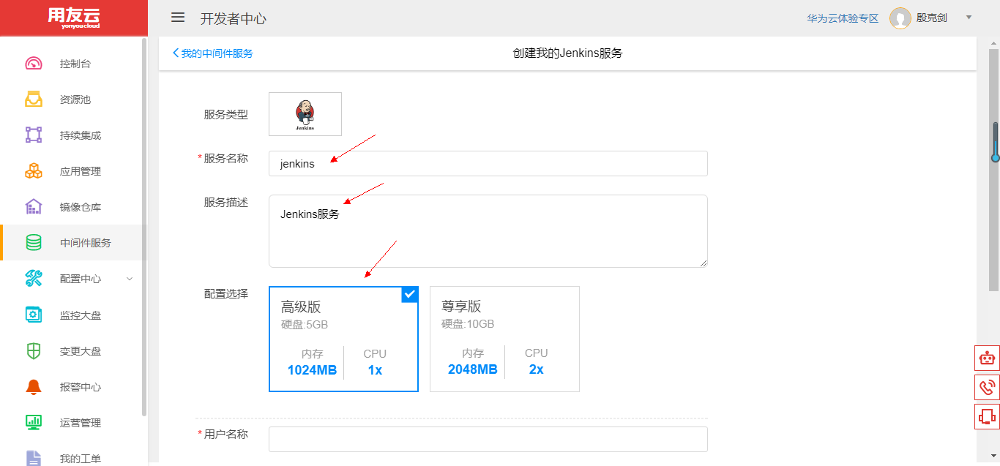
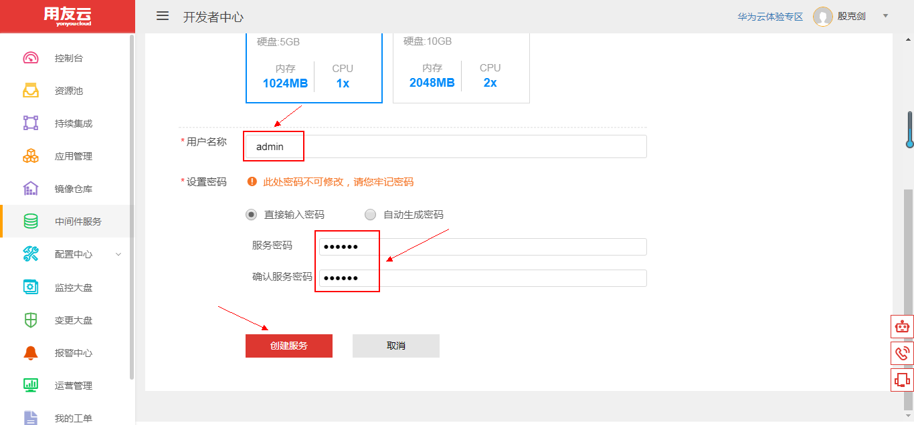
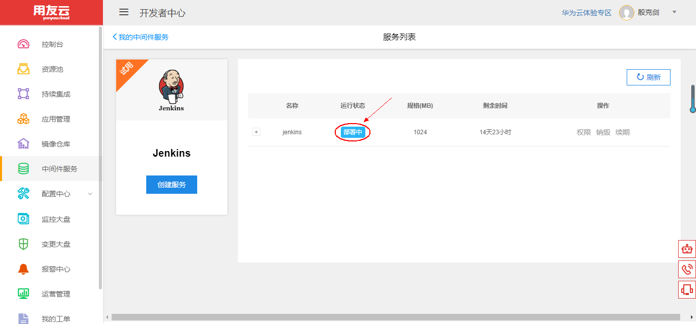
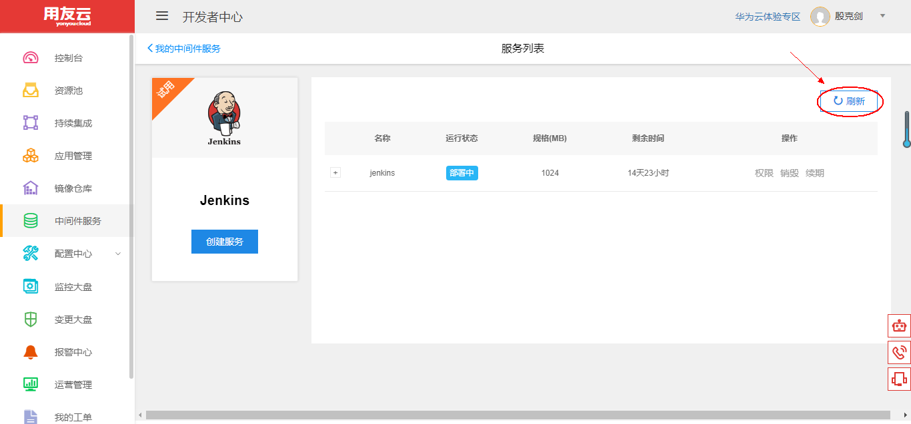
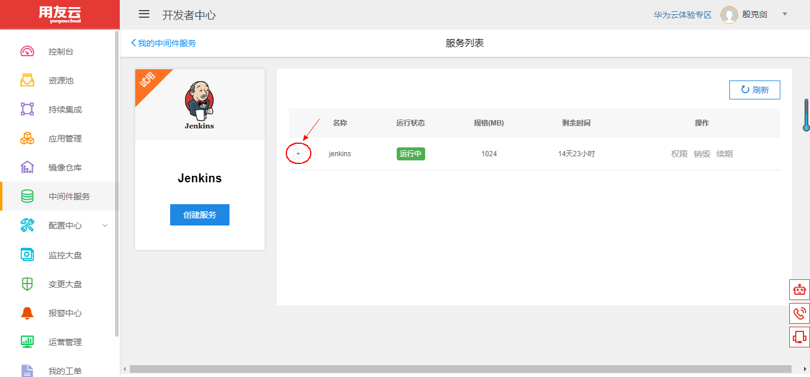
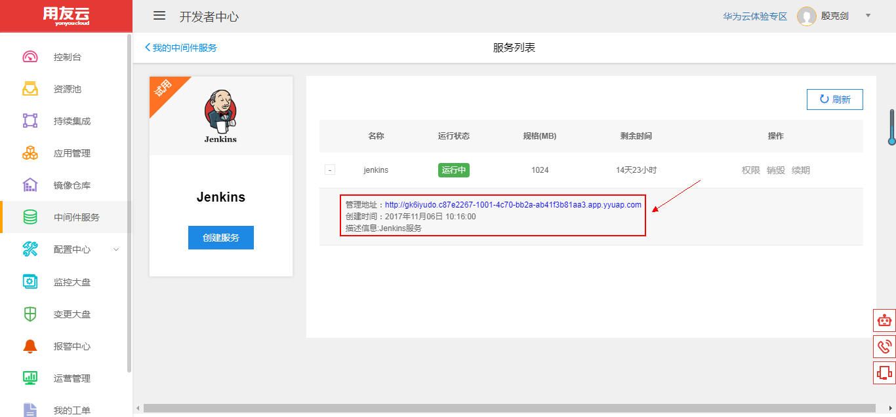
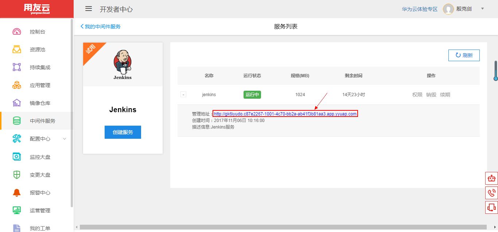
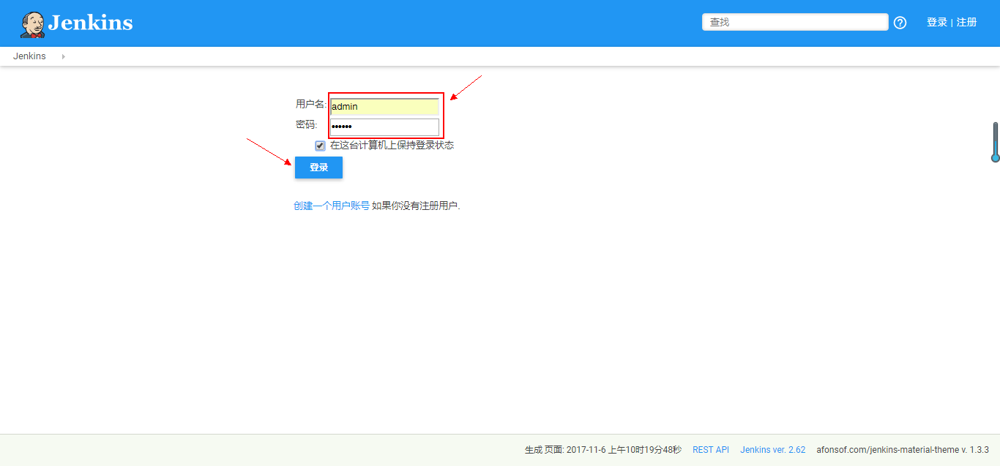

# 使用和管理 Jenkins 服务

## 开发者中心 Jenkins 服务简介 

Jenkins 是一个开源软件项目，是基于 Java 开发的一种持续集成工具，用于监控持续重复的工作，旨在提供一个开放易用的软件平台，使软件的持续集成成为可能。

Jenkins 功能包括：1、持续的软件版本发布/测试项目； 2、监控外部调用执行的工作。

用友云开发者中心 Jenkins 服务提供基础的创建、销毁、续期等功能，用户可根据自身资源情况，选择不同的配额，使自己的应用程序具备持续集成的能力。

## Jenkins 服务管理维护 

1、登录用友云开发者中心官网，[点击这里](https://developer.yonyoucloud.com)。

2、点击左侧菜单 `中间件服务`，进入中间件服务管理界面。

图 1

3、点击 Jenkins 服务所在区域的 `创建一个` 按钮或者点击 `管理我的Jenkins` 按钮，然后点击 `创建服务` 按钮，创建自己的 Jenkins 服务。

图 2

4、输入服务名称、描述，并选择合适的配置。

图 3

设置 Jenkins 用户名和服务密码，点击 `创建服务` 按钮，创建 Jenkins 服务。

图 4

5、进入 Jenkins 服务列表管理界面，可以看到服务的名称、状态、规格、剩余时间等，刚创建的服务为 `部署中` 状态。

图 5

稍等 1~2 分钟，点击 `刷新` 按钮刷新列表状态。

图 6

创建的服务更新为 `运行中` 状态，服务创建成功。

图 7

点击下图中的 `+` 处，查看 Jenkins 服务的详细信息。

图 8

可以看到 Jenkins 服务的管理地址、创建时间等信息。

图 9

##### 注意：创建的 Jenkins 服务默认有效期为半个月，可以点击一次续期延长至一个月，到期前会邮件提醒用户。

6、点击 `管理地址` 对应链接。

图 10

7、进入 Jenkins 登录界面，输入用户名和密码，点击 `登录` 按钮登录。

图 11

8、进入到 Jenkins 主界面，用户可在此界面中创建自己的应用并构建之、管理用户、安装插件、管理系统等。

图 12
