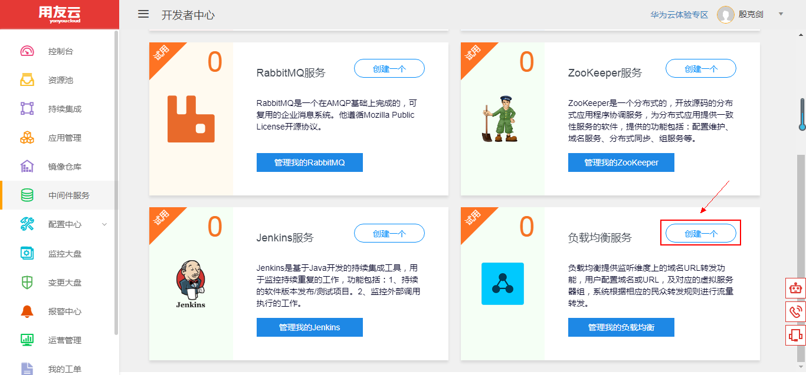
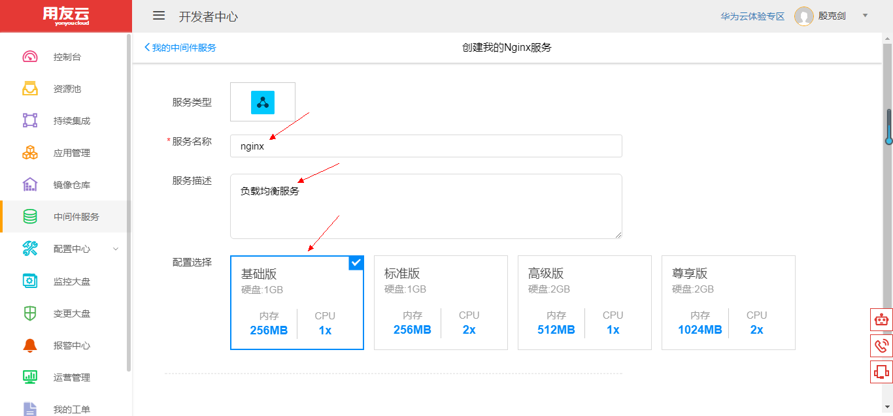
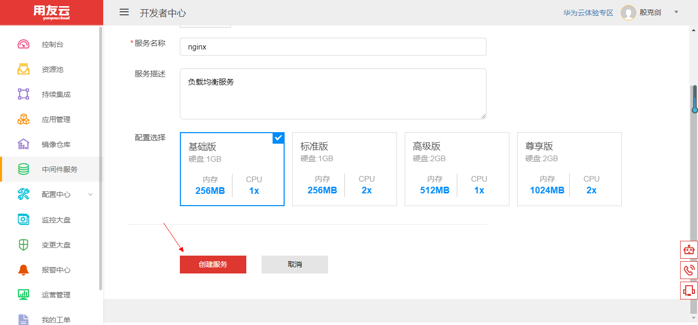
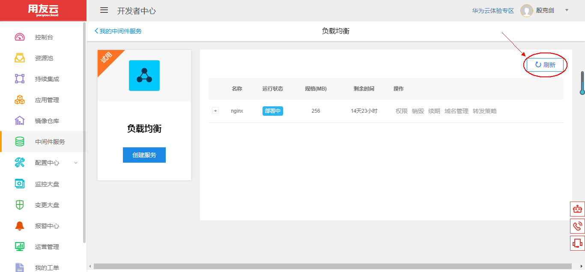
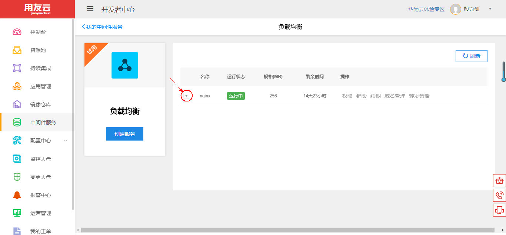
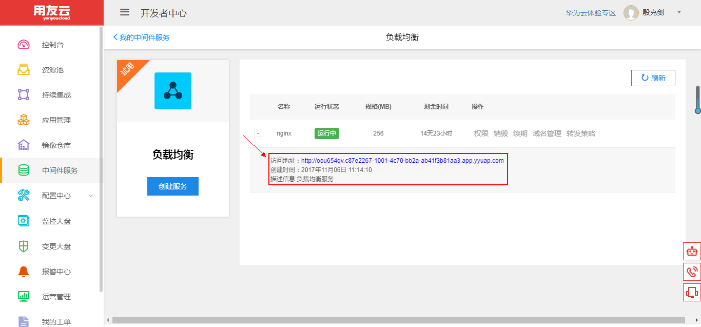

# 使用和管理 负载均衡 服务

## 开发者中心 负载均衡 服务简介 

负载均衡 建立在现有网络结构之上，提供了一种廉价、有效、透明的方法扩展网络设备和服务器的带宽，能够增加系统吞吐量，加强网络数据处理能力，提高网络的灵活性和可用性。

负载均衡的意思就是将请求/数据分摊到多个操作单元上进行执行，例如Web 服务器、FTP 服务器、企业关键应用服务器和其它关键任务服务器等，从而共同完成工作任务。

用友云开发者中心 负载均衡 服务使用 Nginx 来实现，Nginx 是一款轻量级的 Web 服务器/反向代理服务器及电子邮件（IMAP/POP3）代理服务器，其特点是占用内存少、并发能力强，其并发能力在同类型的网页服务器中表现较好。开发者中心 负载均衡 服务提供基础的创建、销毁、续期等功能，用户可根据自身资源情况，选择不同的配额，为自己的应用增加负载均衡的能力。

## 负载均衡 服务管理维护 

1、登录用友云开发者中心官网，[点击这里](https://developer.yonyoucloud.com)。

2、点击左侧菜单 `中间件服务`，进入中间件服务管理界面。

图 1

3、点击 负载均衡 服务所在区域的 `创建一个` 按钮或者点击 `管理我的负载均衡` 按钮，然后点击 `创建服务` 按钮，创建自己的 负载均衡 服务。

图 2

4、输入服务名称、描述，并选择合适的配置。

图 3

点击 `创建服务` 按钮，创建 负载均衡 服务。

图 4

5、进入 负载均衡 服务列表管理界面，可以看到服务的名称、状态、规格、剩余时间等，刚创建的服务为 `部署中` 状态。

图 5

稍等 1~2 分钟，点击 `刷新` 按钮刷新列表状态。

图 6

创建的服务更新为 `运行中` 状态，服务创建成功。

图 7

点击下图中的 `+` 处，查看 负载均衡 服务的详细信息。

图 8

可以看到 负载均衡 服务的访问地址、创建时间等信息。

图 9

##### 注意：创建的 负载均衡 服务默认有效期为半个月，可以点击一次续期延长至一个月，到期前会邮件提醒用户。
