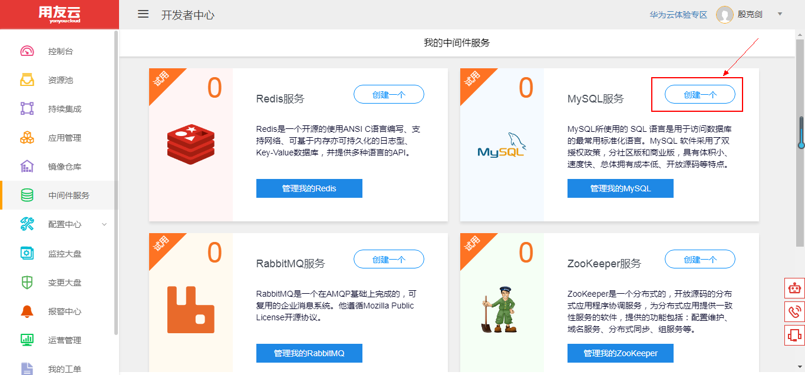
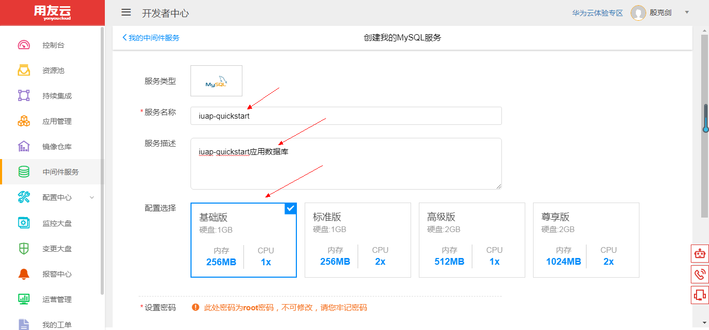
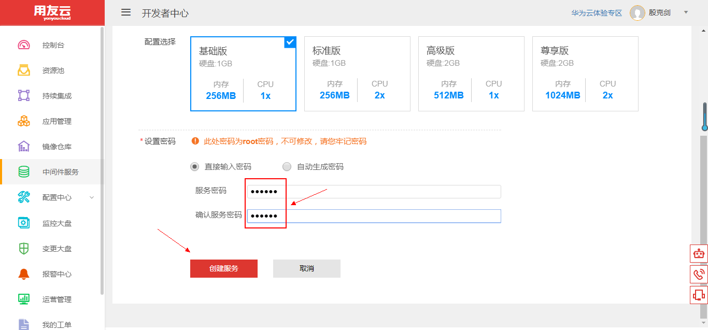
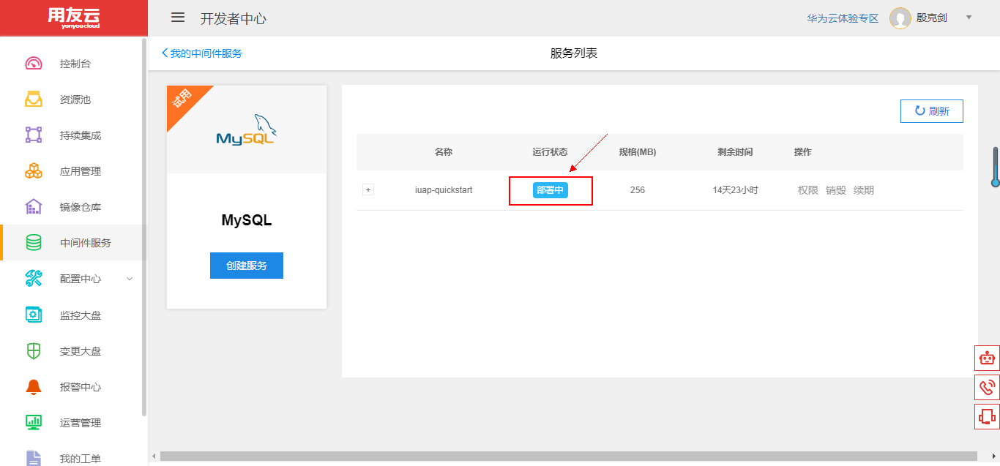
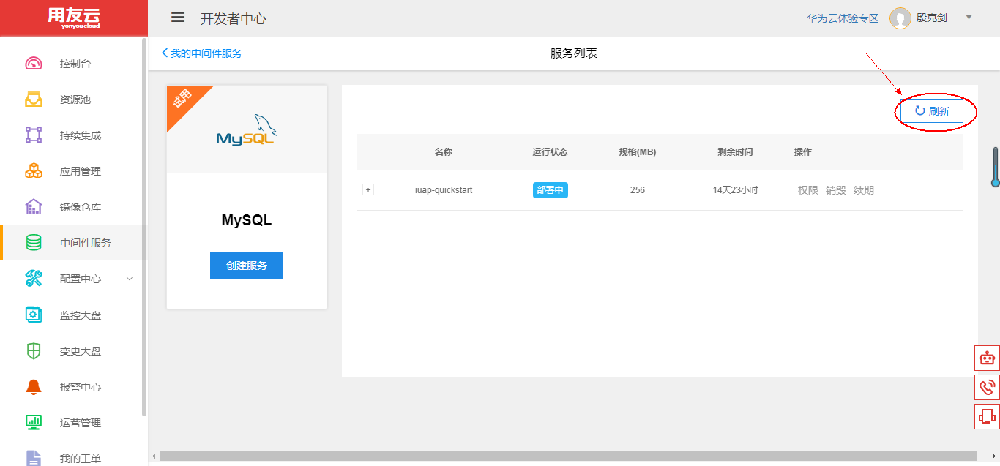
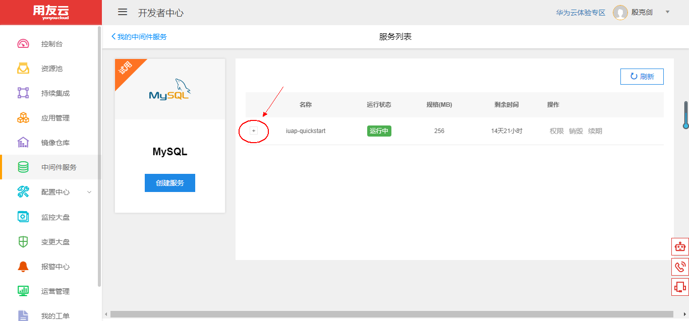
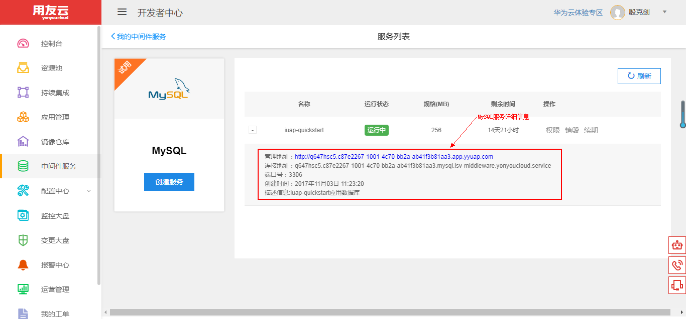
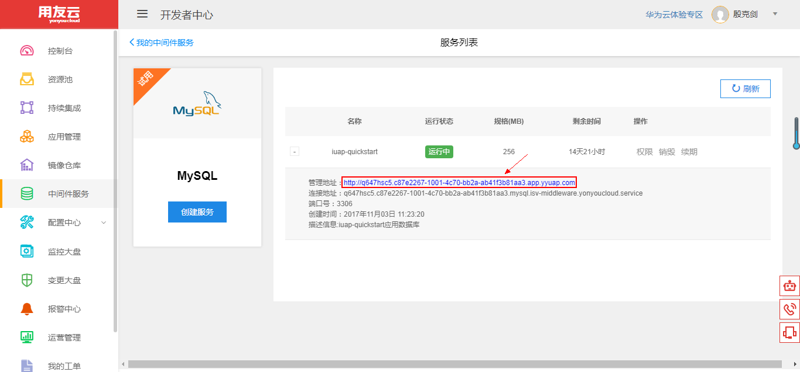
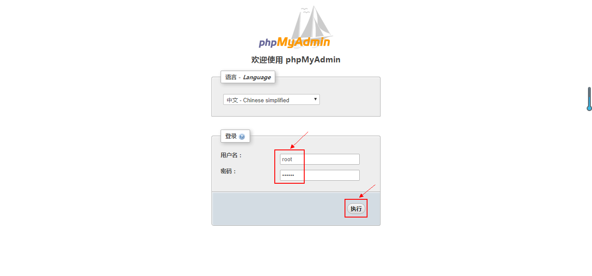
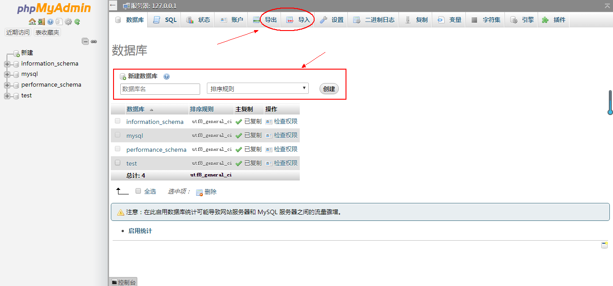

# 使用和管理 MySQL 服务

## 开发者中心 MySQL 服务简介 

MySQL 是一种开放源代码的关系型数据库管理系统，使用最常用的数据库管理语言——SQL（即结构化查询语言）进行数据库管理。 MySQL 由于其性能高、成本低、可靠性好，已经成为最流行的开源数据库，被广泛地应用在 Internet 上的中小型网站中。

用友云开发者中心 MySQL 服务集成 MySQL 数据库服务器和开源数据库管理工具 phpMyAdmin 于一体，并提供基础的创建、销毁、续期等功能。用户可根据自身资源情况，选择不同的配额，为自己应用提供相适应的数据库能力。

利用 MySQL 关系型数据库的能力和 phpMyAdmin 的可视化管理界面，结合中间件服务的其他功能，开发者可以快速地开发使用关系型数据库的互联网应用。

## MySQL 服务管理维护 

1、登录用友云开发者中心官网，[点击这里](https://developer.yonyoucloud.com)。

2、点击左侧菜单 `中间件服务` ，进入中间件服务管理界面。

图 1

3、点击 MySQL 服务所在区域的 `创建一个` 按钮或者点击 `管理我的MySQL` 按钮，然后点击 `创建服务` 按钮，创建自己的 MySQL 服务。

图 2

4、输入服务名称、服务描述，并选择合适的配置。

图 3

设置 MySQL 数据库密码，点击 `创建服务` 按钮，创建 MySQL 服务。

图 4

5、进入 MySQL 服务列表管理界面，可以看到服务的名称、状态、规格、剩余时间等，刚创建的服务为 `部署中` 状态。

图 5

稍等 1~2 分钟，点击 `刷新` 按钮刷新列表状态。

图 6

创建的服务更新为 `运行中` 状态，服务创建成功。

图 7

点击下图中 `+` 号处，查看 MySQL 服务的详细信息。

图 8

可以看到 MySQL 服务的详细信息，包括 MySQL 服务的外网管理界面地址、内网链接地址、端口号等，用户可以在开发者中心的网络内使用此连接地址作为应用的配置。

图 9

##### 注意：创建的 MySQL 服务默认有效期为半个月，可以点击一次续期延长至一个月，到期前会发送邮件通知用户。

6、点击 `管理地址` 对应链接。

图 10

7、进入 phpMyAdmin 登录界面，输入用户名和密码，点击 `执行` 按钮登录。

图 11

8、进入到 phpMyAdmin 数据库管理系统，用户可在此界面中管理自己应用的 MySQL 数据库，例如创建数据库和数据表，直接导入 sql 文件执行或将数据库导出为 sql 文件。。

图 12

