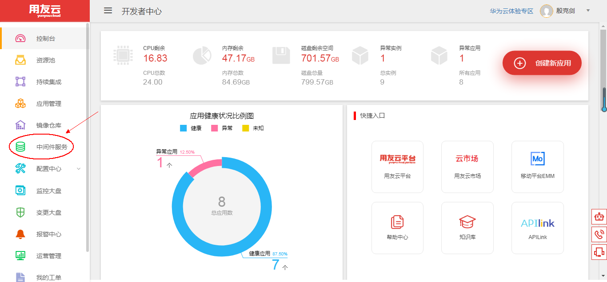
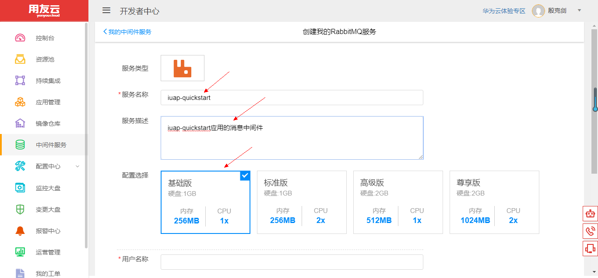
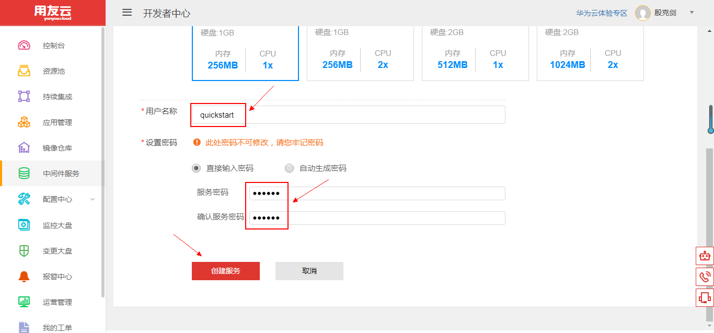
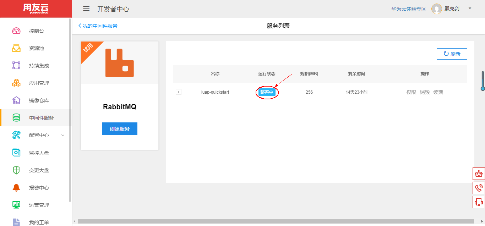
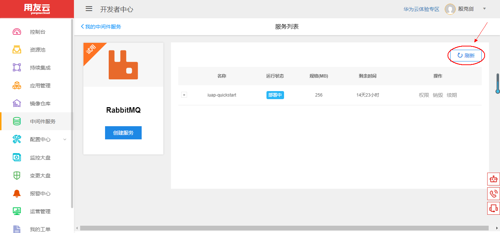
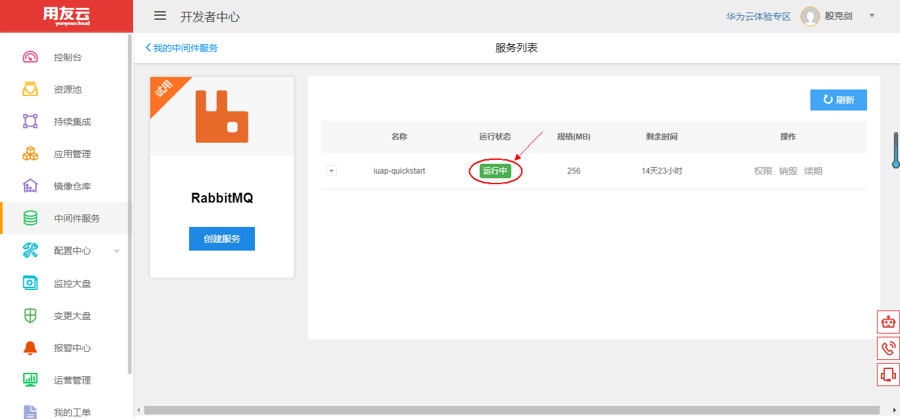
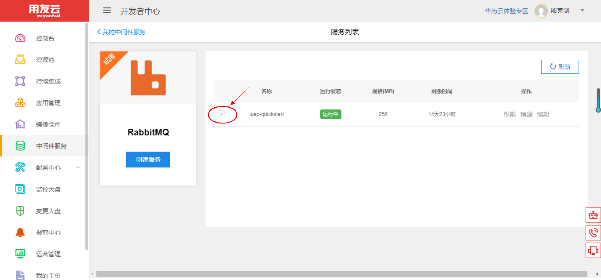
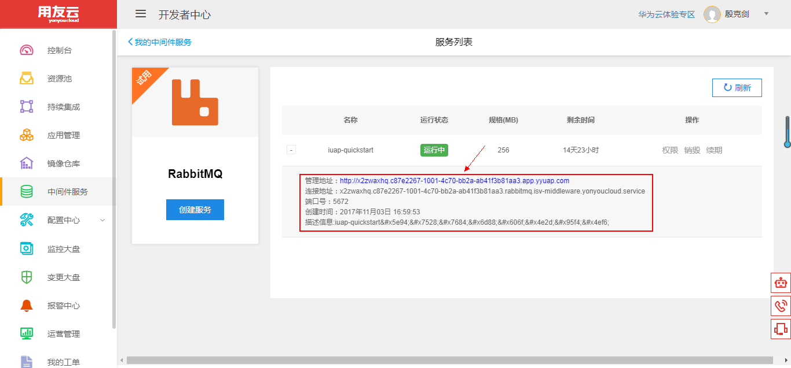
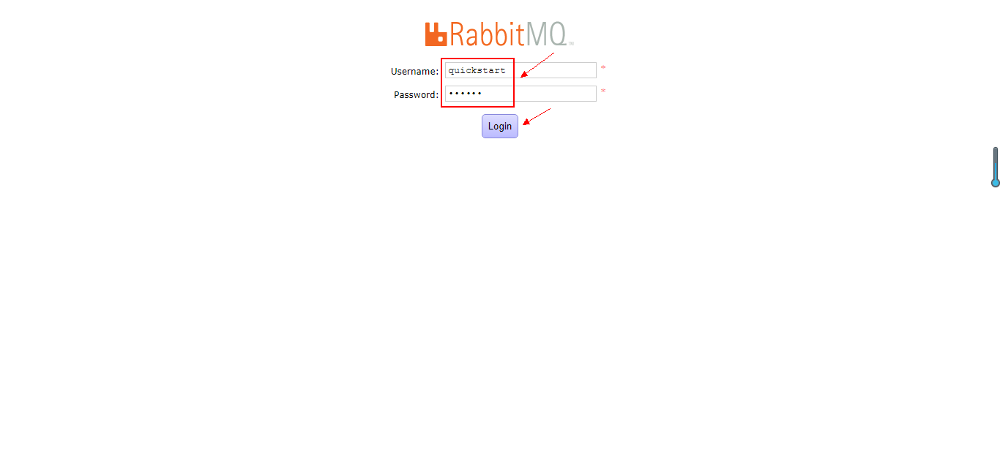
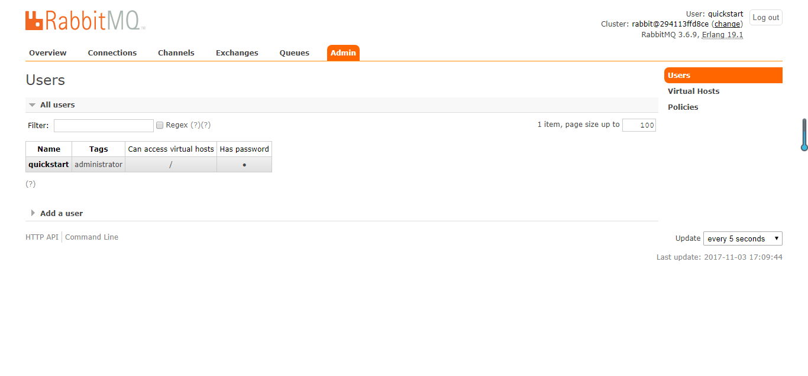

# 使用和管理 RabbitMQ 服务

## 开发者中心 RabbitMQ 服务简介 

AMQP 即 Advanced Message Queuing Protocol，高级消息队列协议，是应用层协议的一个开放标准，为面向消息的中间件而设计。AMQP 的主要特征是面向消息、队列、路由（包括点对点和发布/订阅）、可靠性、安全。消息中间件主要用于组件之间的解耦，消息的发送者无需知道消息使用者的存在，反之亦然。

RabbitMQ 是实现 AMQP 的消息中间件的一种，最初起源于金融系统，用于在分布式系统中存储转发消息，在易用性、扩展性、高可用性等方面表现优异。

RabbitMQ 是一个开源的 AMQP 实现，服务器端用 Erlang 语言编写，支持多种客户端，如Python、Ruby、.NET、Java、JMS、C、PHP、ActionScript、XMPP、STOMP等，支持AJAX。

用友云开发者中心提供消息中间件 RabbitMQ 服务，包括创建、销毁、续期等功能，用户可根据自身资源情况，选择不同的配额，以获得与自己应用相适应的消息服务能力。

## RabbitMQ 服务管理维护 

1、登录用友云开发者中心官网，[点击这里](https://developer.yonyoucloud.com)。

2、点击左侧菜单 `中间件服务`，进入中间件服务管理界面。

图 1

3、点击 RabbitMQ 服务所在区域的 `创建一个` 按钮或者点击 `管理我的RabbitMQ` 按钮，然后点击 `创建服务` 按钮，创建自己的 RabbitMQ 服务。

图 2

4、输入服务名称、描述，并选择合适的配置。

图 3

设置 RabbitMQ 用户名和服务密码，点击 `创建服务` 按钮，创建 RabbitMQ 服务。

图 4

5、进入 RabbitMQ 服务列表管理界面，可以看到服务的名称、状态、规格、剩余时间等，刚创建的服务为 `部署中` 状态。

图 5

稍等 1~2 分钟，点击 `刷新` 按钮刷新列表状态。

图 6

创建的服务更新为 `运行中` 状态，服务创建成功。

图 7

点击下图中的 `+` 处，查看 RabbitMQ 服务的详细信息。

图 8

可以看到 RabbitMQ 服务的管理地址、内网连接地址、端口号等信息。用户可以在开发者中心的网络内使用连接地址进行应用的配置。

图 9

##### 注意：创建的 RabbitMQ 服务默认有效期为半个月，可以点击一次续期延长至一个月，到期前会发送邮件通知用户。

6、点击 `管理地址` 对应链接。

图 10

7、进入 RabbitMQ 登录界面，输入用户名和密码，点击 `Login` 按钮登录。

图 11

8、进入到 RabbitMQ 管理界面，用户可在此界面中管理自己应用的 RabbitMQ，例如创建用户、给用户赋予权限、查看连接状态等。

图 12
