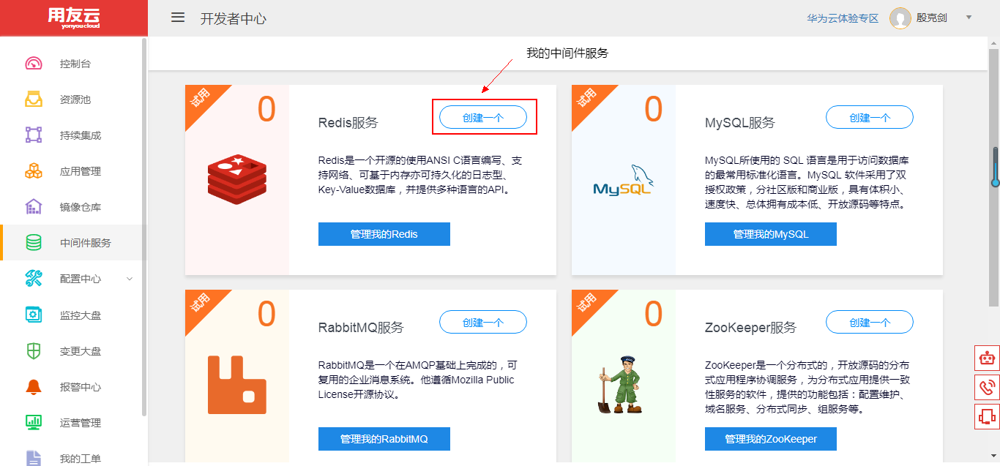
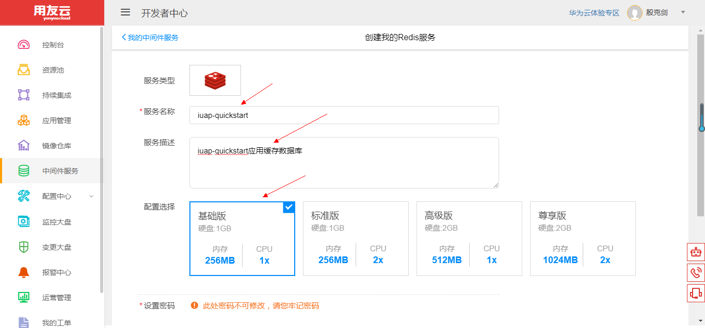
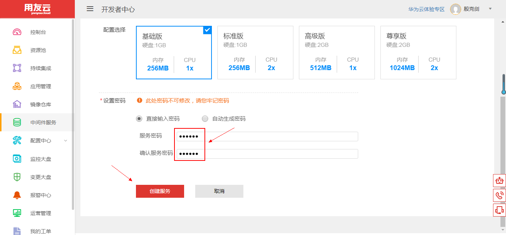
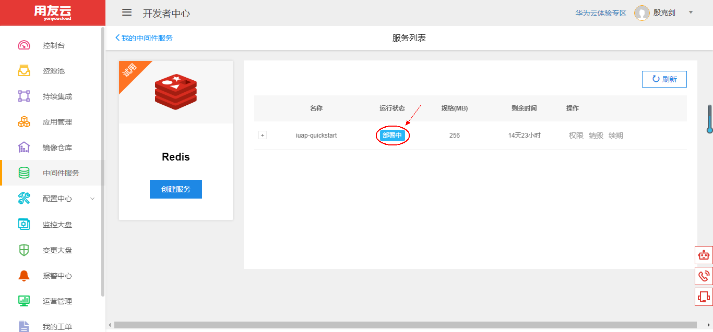
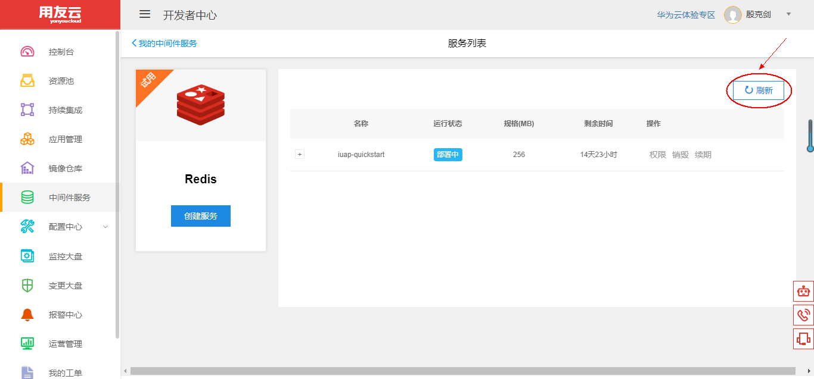
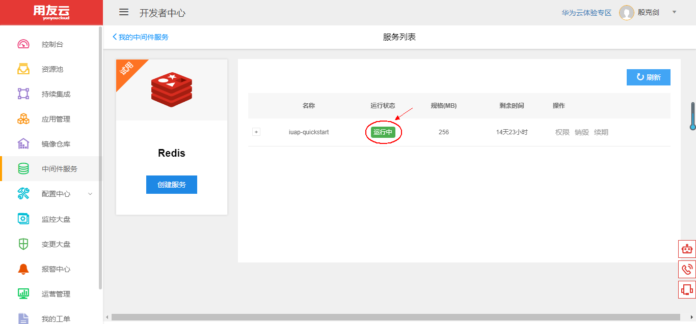
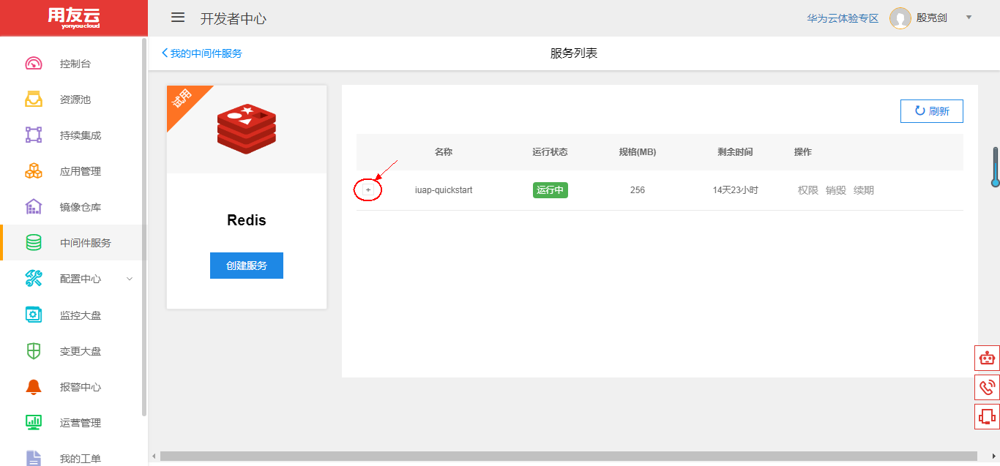
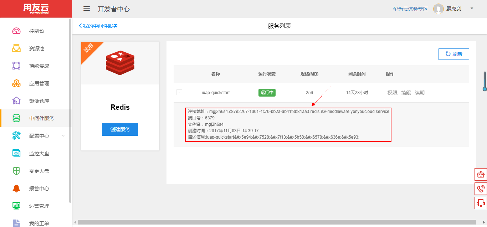

# 使用和管理 Redis 服务

## 开发者中心 Redis 服务简介 

Redis 是一个开源的、基于内存的高性能 key-Value 型数据库。Redis 不仅仅支持简单的 key-value 类型的数据，同时还提供 list、set、zset、hash等数据结构的存储，这些数据类型都支持 push/pop、add/remove 、取交集、并集和差集及其他更丰富的操作，而且这些操作都是原子的，并提供了丰富的 API 供不同编程语言调用。

用友云开发者中心 Redis 服务基于 `Redis 2.8.19` 版本进行了优化和配置，提供简单快速的服务创建和管理功能，为开发者提供便捷实用的 key-value 数据库能力。

用友云开发者中心 Redis 服务提供基础的创建、销毁、续期等功能，用户可根据自身资源情况，选择不同的配额，获得与自己应用相适应的健值型数据库能力。

## Redis 服务管理维护 

1、登录用友云开发者中心官网，[点击这里](https://developer.yonyoucloud.com)。

2、点击左侧菜单 `中间件服务`，进入中间件服务管理界面。

图 1

3、点击 Redis 服务所在区域的 `创建一个` 按钮或者点击 `管理我的Redis` 按钮，然后点击 `创建服务` 按钮，创建自己的 Redis 服务。

图 2

4、输入服务名称、描述，并选择合适的配置。

图 3

设置服务密码，点击 `创建服务` 按钮，创建 Redis 服务。

图 4

5、进入 Redis 服务列表管理界面，可以看到服务的名称、状态、规格、剩余时间等，刚创建的服务为 `部署中` 状态。

图 5

稍等 1~2 分钟，点击 `刷新` 按钮刷新列表状态。

图 6

创建的服务更新为 `运行中` 状态，服务创建成功。

图 7

点击下图中的 `+` 处，查看 Redis 服务的详细信息。

图 8

可以看到 Redis 服务的内网连接地址、端口号、实例名等信息。用户可以在开发者中心的网络内使用此连接地址进行应用的配置。

图 9

##### 注意：创建的 Redis 服务默认有效期为半个月，可以点击一次续期延长至一个月，到期前会邮件提醒用户。
