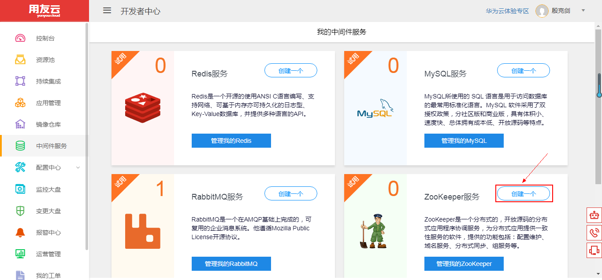
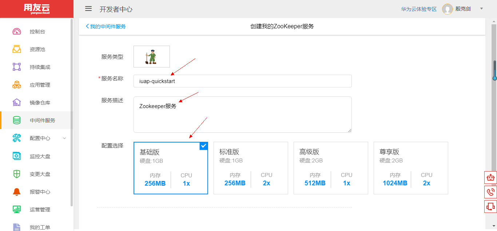
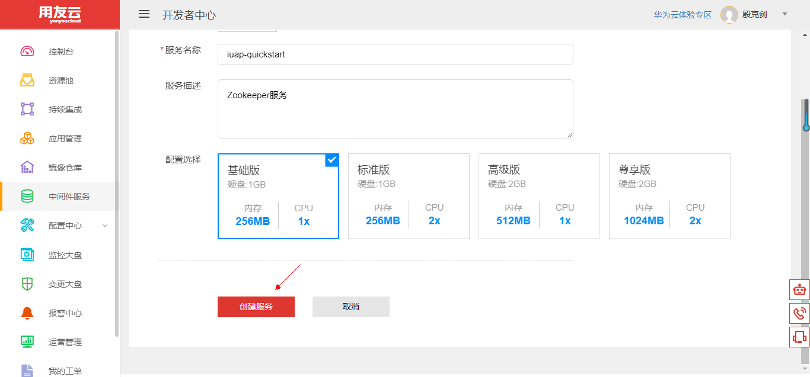
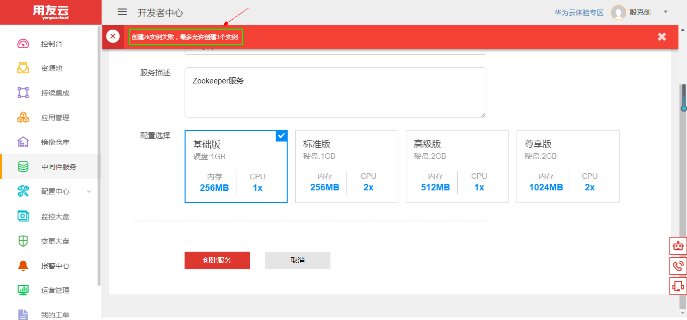

# 使用和管理 Zookeeper 服务

## 开发者中心 Zookeeper 服务简介 

ZooKeeper 是一个分布式的、开放源代码的应用程序协调服务，是 Google Chubby 的一个开源实现，也是 Hadoop 和 Hbase 的重要组件。它是一个为分布式应用提供一致性服务的组件，提供的功能包括：配置维护、域名服务、分布式同步、组服务等。

ZooKeeper 的目标就是封装好复杂易出错的关键服务，将简单易用的接口和性能高效、功能稳定的系统提供给用户。

用友云开发者中心 Zookeeper 服务提供基础的创建、销毁、续期等功能，用户可根据自身资源情况，选择不同的配额，将其应用到自己的应用程序中去。

## Zookeeper 服务管理维护 

1、登录用友云开发者中心官网，[点击这里](https://developer.yonyoucloud.com)。

2、点击左侧菜单 `中间件服务`，进入中间件服务管理界面。

图 1

3、点击 Zookeeper 服务所在区域的 `创建一个` 按钮或者点击 `管理我的Zookeeper` 按钮，然后点击 `创建服务` 按钮，创建自己的 Zookeeper 服务。

图 2

4、输入服务名称、描述，并选择合适的配置。

图 3

点击 `创建服务` 按钮，创建 Zookeeper 服务。

图 4

##### 注意：创建的 Zookeeper 服务默认有效期为半个月，可以点击一次续期延长至一个月，到期前会邮件提醒用户。

5、每个租户默认允许创建 3 个 Zookeeper 服务实例，系统会给出提醒信息。

图 5
