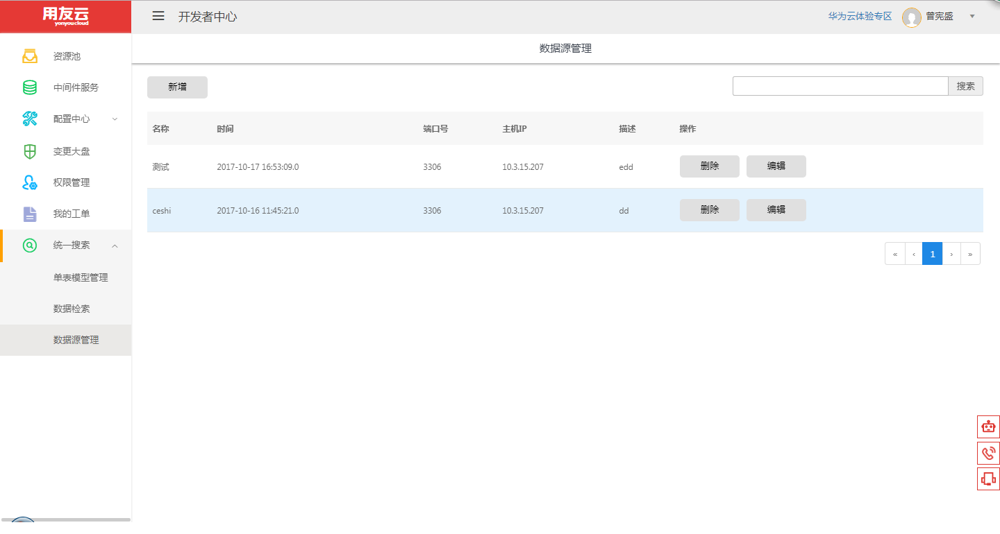
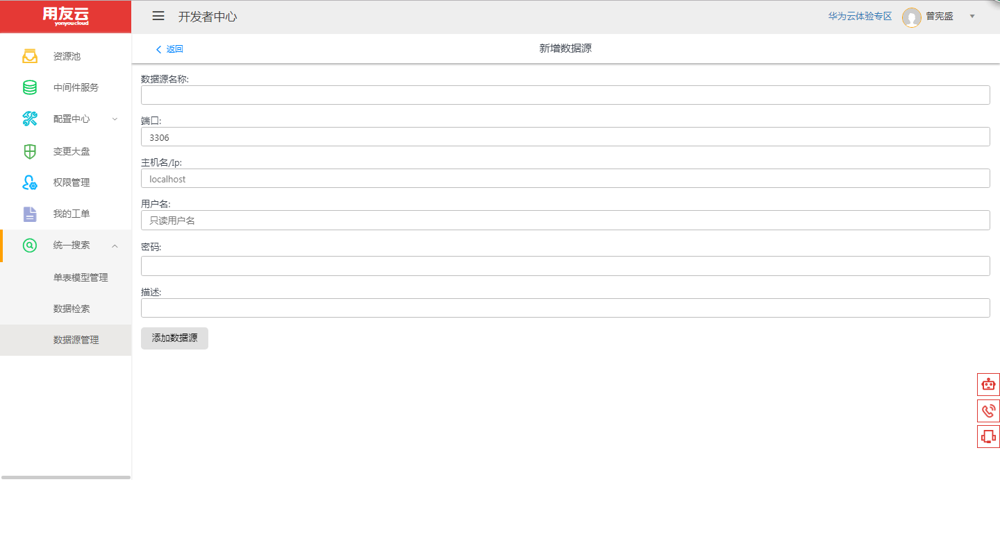
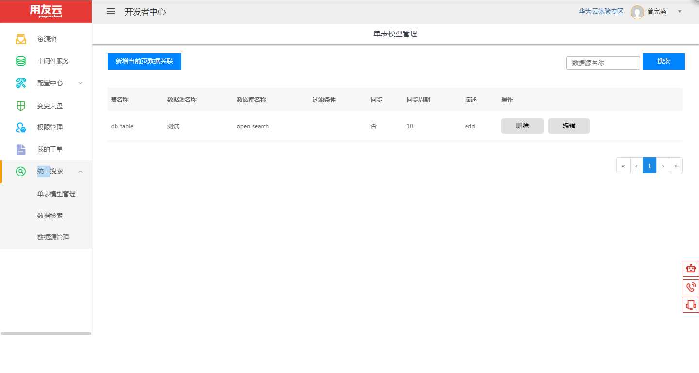
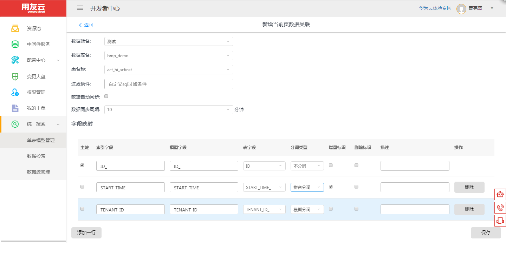
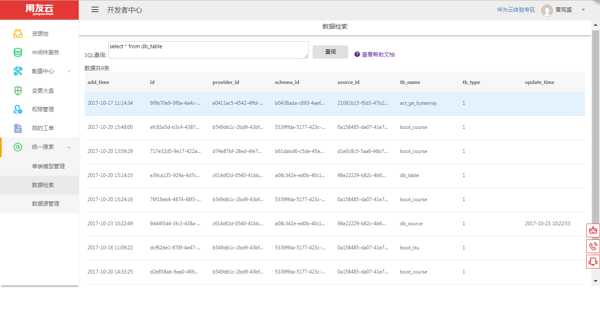

# 统一搜索服务

## 开发者统一搜索服务简介 ##

统一搜索服务是一个数据托管服务，支持数据结构的自由定制，可以解决多个微服务之间的基础数据调用模型复杂、数据关联模型复杂、数据检索效率慢的问题，主要有以下几大基础功能：

- 基础数据共享，解决数据孤岛问题；
- 复杂网状模型扁平化，简化关系模型；
- 数据安全，能够根据角色进行精确到字段级别的授权；
- 数据近实时同步
- 提供快速、多样的检索能力

## 统一搜索流程 ##

第一步：登录云开发者中心网站：https://developer.yonyoucloud.com

第二步：点击"统一搜索-数据源管理"菜单,进入数据源管理界面。

图 1

第三步：输入数据源名称，IP或主机名，端口，只读权限的用户名、密码，创建数据源。

图 2

第四步：点击"统一搜索-单表模型管理"菜单,进入单表模型管理界面。

图 3

第五步：点击"新增当前页数据关联"按钮，选择数据源，数据库，表，过滤条件，数据自动同步，同步周期，以及字段映射关系，创建数据模型以及同步周期。

图 4

第六步：点击"统一搜索-数据检索"菜单,进入数据检索界面，可以根据类SQL语法查询数据。

图 5

第七步：统一搜索-数据检索的类SQL语法查询数据帮助文档如下：

<a href="opensearch-help.md" title="帮助文档">查看帮助文档</a>

