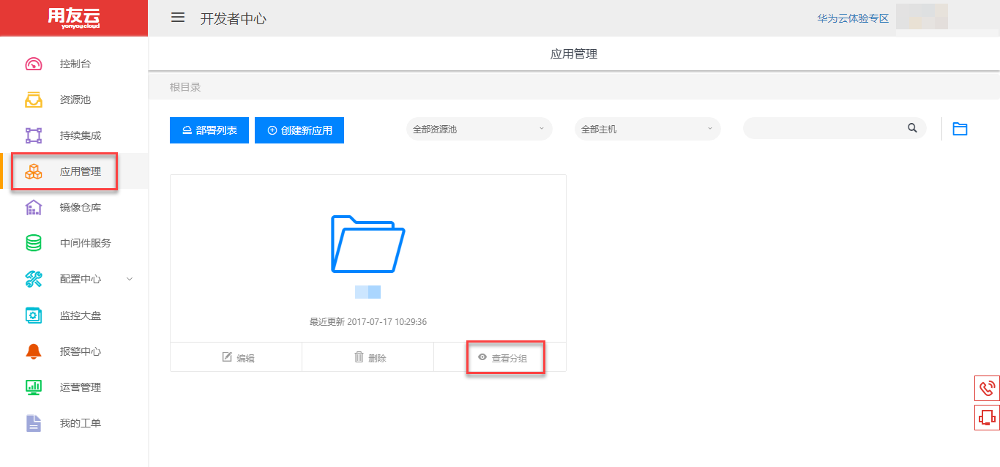
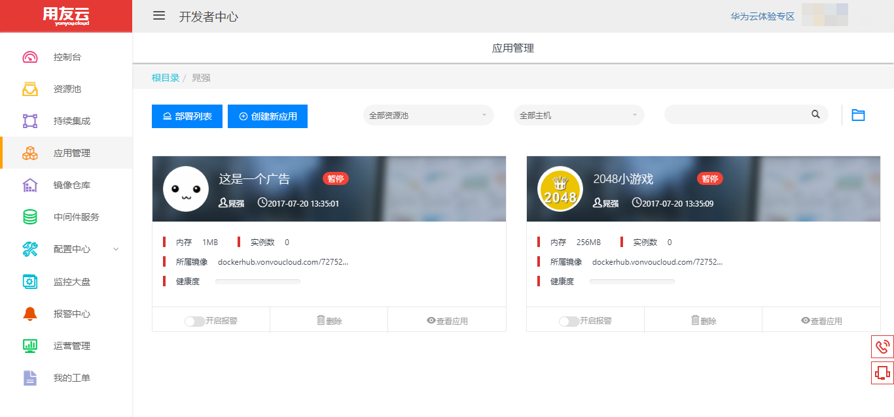
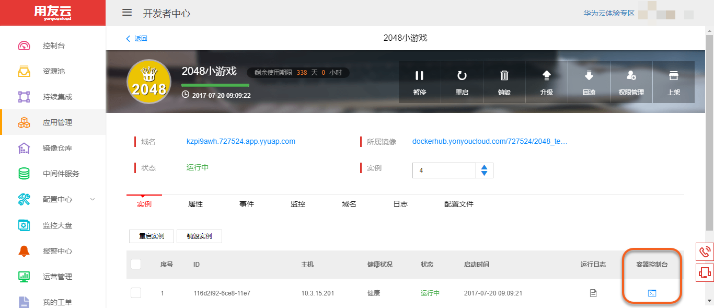
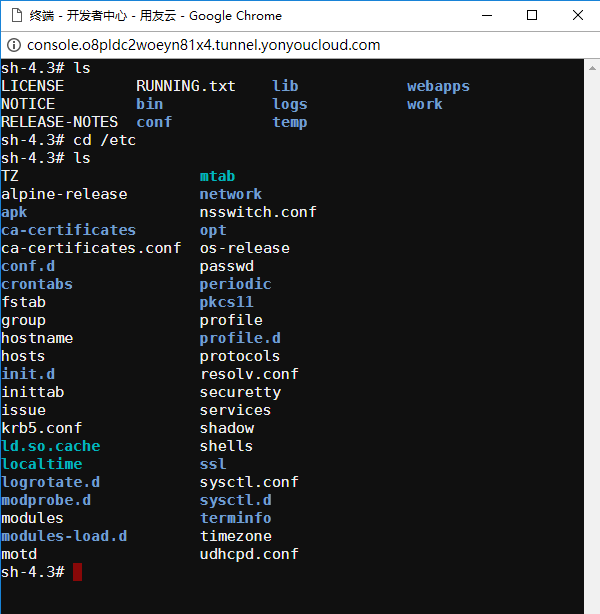

# 在线终端

用友云开发者中心提供了在线的命令行终端，为用户解决了容器动态调整的问题。用户可以通过应用详情页进入容器控制台，进入容器内部进行高级操作。

步骤如下：

1.点击左侧菜单栏【应用管理】，进入应用卡片列表页面，如图1所示。

图 1

2.点击要操作的应用卡片，进入应用详情页，如图2所示。

图 2

3.在应用详情页的【实例】页签中，找到要操作容器的实例条目，点击条目左侧的容器控制台图标，进入在线终端，如图3所示。

图 3

4.在打开的终端窗口中可以对容器进行自由的操作，如图4所示。

图 4
