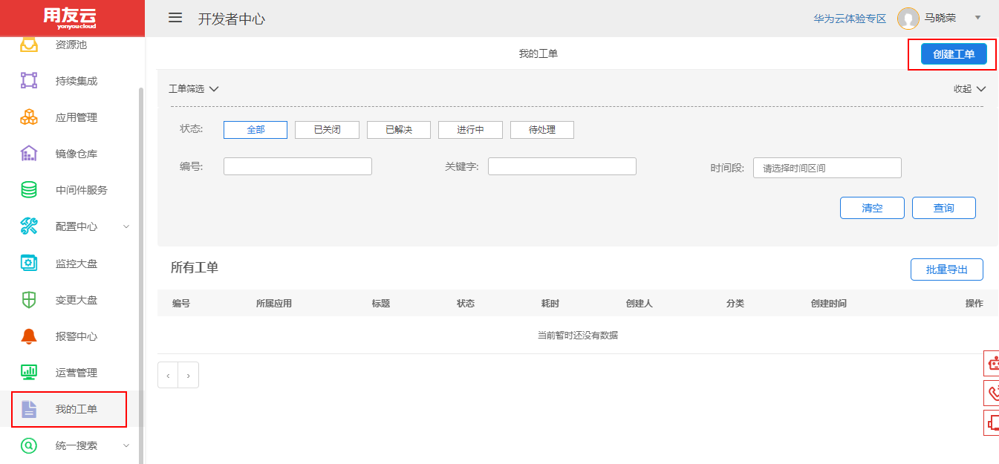
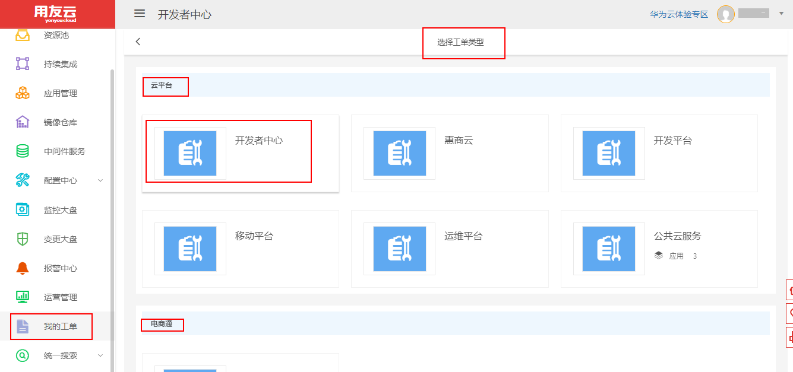
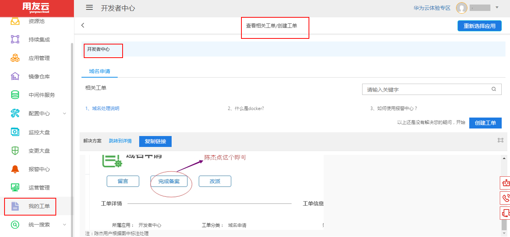
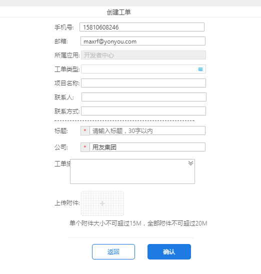

### 概述
如果对当前开发者中心等用友平台有什么改进意见或者建议，用户或开发就可以通过提工单的方式向开发人员反馈信息。我的工单页面如图1所示。

 图 1

用户可以通过右上角的``创建工单``按钮来创建不同类型的工单，，分别有云平台、电商通、云市场、友云采、友云音、友空间几种类型，这里可以作为这些平台的工单入口，任意用户或开发都可以随时提出自己的意见。部分列表如图2所示。

 图 2

下面以开发者中心的工单为例，介绍``我的工单``的使用方法。开发者中心在云平台大类型下，点击类型``开发者中心``按钮，可以看到如下页面，如图3所示。

 图 3

其中``相关工单``里面列出了已经提过的工单，点击相应工单名称可查看其解决方案。如果现有工单不能解决您的疑问，则可以点击页面上的``创建工单``按钮创建新的工单。创建新工单的界面如图4所示。

 图 4

创建工单完成后，相应的开发人员即可看到对应的内容，并及时响应相关问题。
