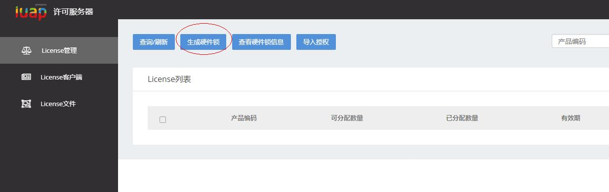

#iuap-licenseserver授权配置

专属云服务在使用前要进行授权。

##登录iuap-licenseserver

服务地址：http://部署ip:8080/iuap-licenseserver/login

初始用户名密码：admin/admin

点击生成硬件锁

产品号填写microservice，选择全部系统

下载得到的文件备用

##在udn申请授权
访问
http://udn.yyuap.com/license.php，网页要求先注册

选择uapv6，点击申请license，按要求填入信息

上传文件时请选择上一个步骤生成的硬件锁文件（上传文件需要浏览器支持flash插件）

提交后在邮箱中收到授权文件license.resp

##授权文件导入

访问地址：http://部署ip:8080/iuap-licenseserver/login

选择导入授权

点击选择文件，选择上一步选择的授权文件

再点击导入授权文件

导入授权成功

##没有授权的体现

未授权的productID（产品编码）的license点数为-1，应用启动时会无法通过license控制验证，报错："当前已注册应用数为:0， 已达到license注册最大数量:-1，未通过license控制验证！"。产品编码将配置在servmeta的license.productCode中。

一个license点数对应一个以providerId-appCode为标识的应用，即eureka上注册的一行，当已注册数量等于license分配的最大点数时，新标识（providerId-appCode）的应用实例注册时将被拦截无法注册。

