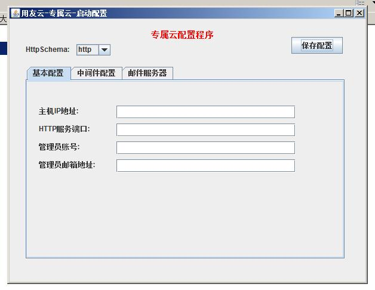

# 配置流程（介质清单）

##启动准备

###准备mysql数据库

	script\sql

启动微服务治理平台之前需要安装mysql数据库并且导入位于上方路径的sql脚本.

###修改配置变量

- 直接配置

 /script/env/envset.txt配置文件有一些配置变量需要修改

		#下面几个ip不能填localhost,因为portal的配置会将这ip交个浏览器直接调用
		zookeeper_url=localhost:2181
		yht_url=http://localhost:8080
		portal_loginUrl=http://localhost:8080/portal/sso/login.jsp
		sdk_servername=http://localhost:8080
		sdk_ip=localhost
		sdk_port=8080
		#kafka地址
		kafka_ip=localhost:9092
		#结束

		zookeeper_url
		yht_url
		portal_loginUrl
		sdk_servername
		localhost
		kafka_ip
		请改成您的本机ip,如果后面带有端口号请加上端口号

- 图形化配置(与直接配置二选一)
	
	双击exclusive_cloud_installer.jar启用图形化配置器

	依次填入相关配置就可以了

##启动微服务治理平台
	
	linux
	运行startup.sh脚本
 

	windows
	运行startup.bat脚本

##访问

这里部署机ip为172.20.28.31，请您根据您自己的部署机ip替换

部署成功以后可以通过以下三个页面进行验证：

门户页面 portal_url ： http://172.20.28.31:8080/portal

注册中心 eureka ： http://172.20.28.31:8080/registry/

搜索引擎 elasticsearch ：http://172.20.28.31:9200/_plugin/head/
