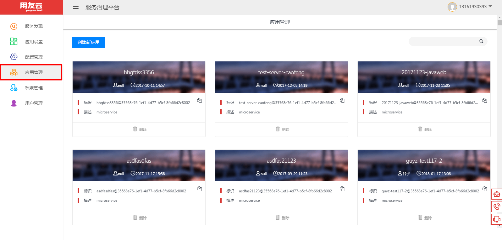
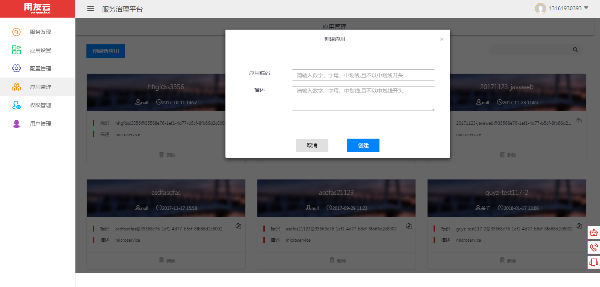
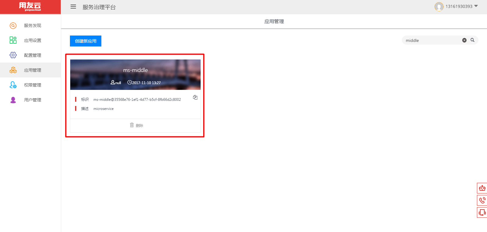
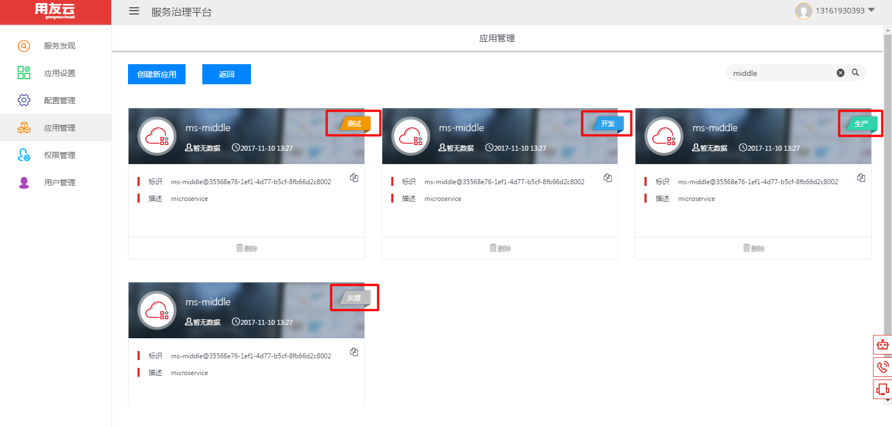
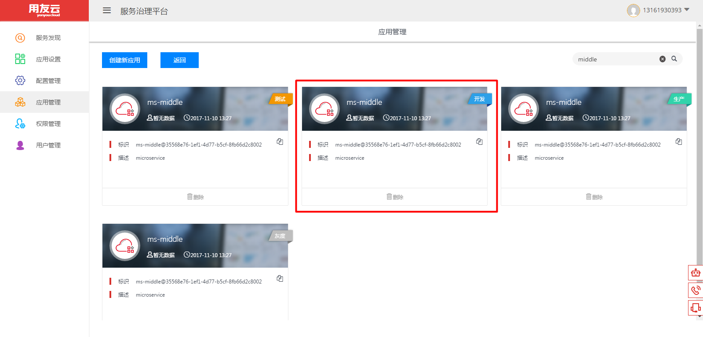
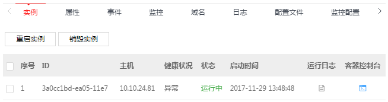
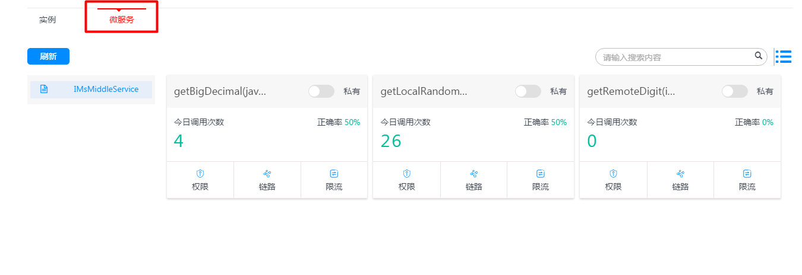
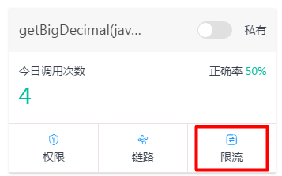
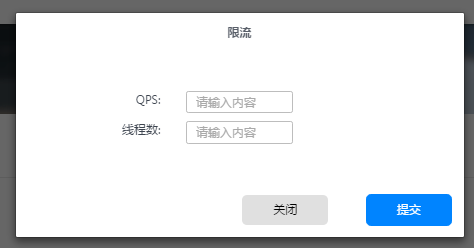

# 应用管理

## 应用创建
- 单击侧边栏【应用管理】进入【应用管理界面】

- 点击【创建新应用】创建应用

## 环境管理
- 点击任意一个【应用】

- 【应用】中会显示对应生成的四套环境，测试(test)；开发(dev)；生产(online)；灰度(stage)

## 服务管理
- 选择某一【环境】点击

- 可以看见正在运行的【实例】

- 切换到【微服务】页签下可见服务详情

## 服务限流
- 点击具体服务的【限流】按钮

- 弹出【限流】对话框，可以输入QPS和线程的数值

