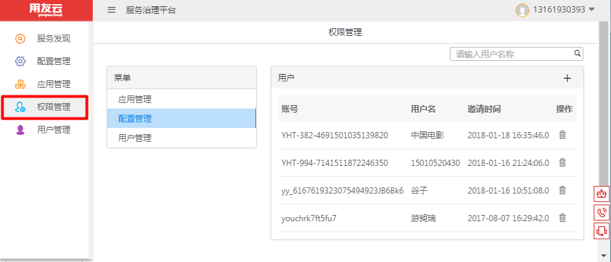
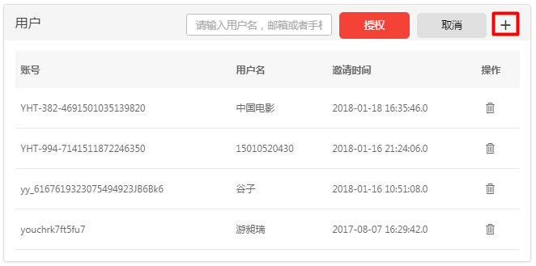
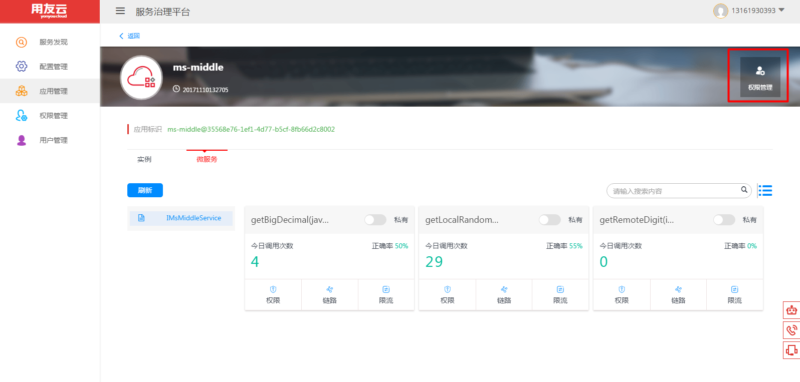
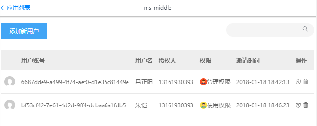
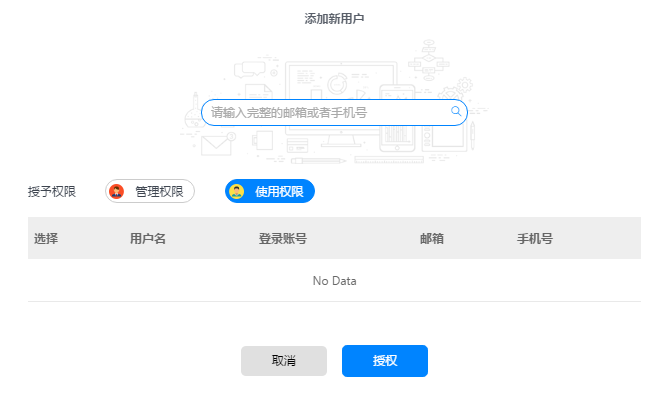
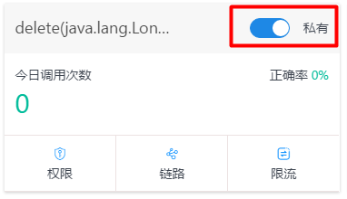
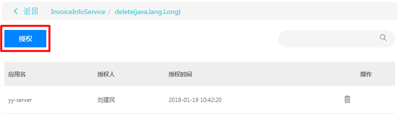
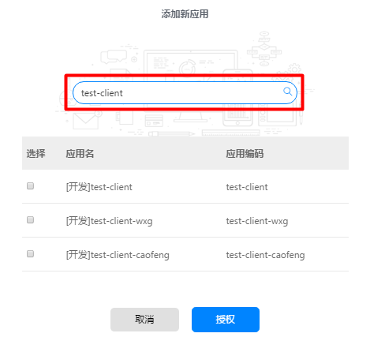

# 权限管理

## 菜单权限
- 菜单权限只有ISV管理员可见

- 点击【+】可以添加用户，为用户授权

## 应用权限
- 进入应用详情界面，点击【权限管理】进入此应用的权限操作界面

- 点击【添加新用户】寻找授权用户，选择授予管理或者使用权限

## 服务权限
- 将服务的权限设置为【私有】，才可以进行服务授权操作

- 点击【权限】进行服务授权

- 【授权】进行详细操作

