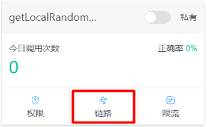
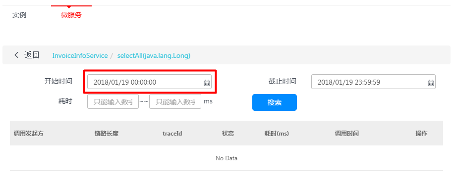
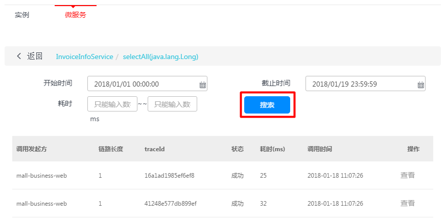

# 链路追踪
**分布式链路追踪功能提供在微服务架构下快速定位问题的能力。能够完整重现一次事务的完整调用链路，在各个节点消耗的时间，以及各个节点的状态等信息。**
## 调用链搜索
- 点击服务的【链路】按钮，可以查看调用情况

- 选取查询的开始时间可查看以往的历史信息

- 点击【搜索】查看调用的的链路信息

## 调用链查看
- 单击【查看】按钮，可以查看此条链路的详细信息

- 可以检查具体的服务和方法

