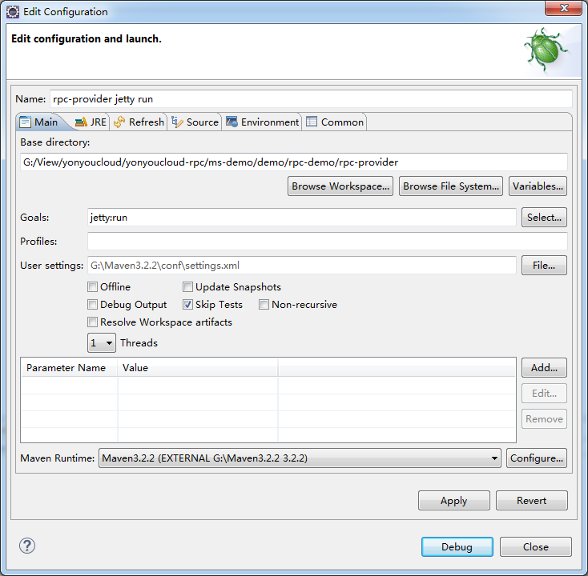
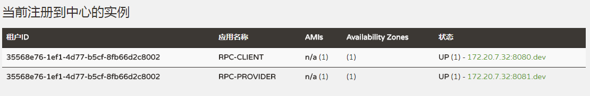
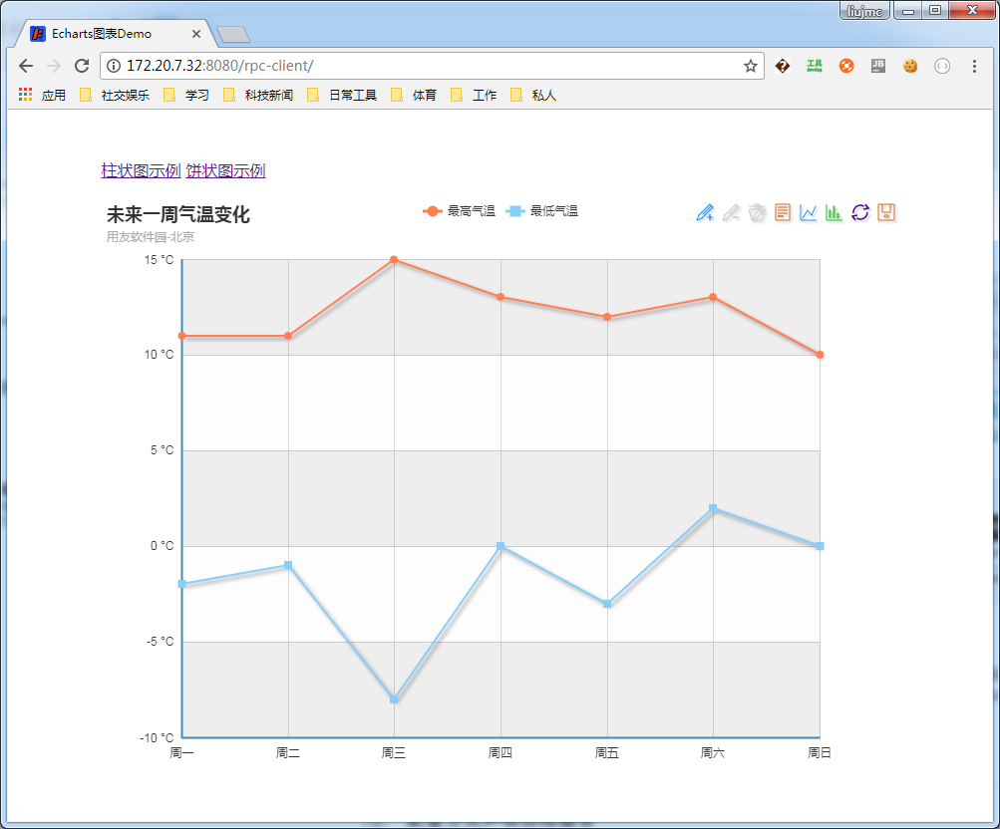
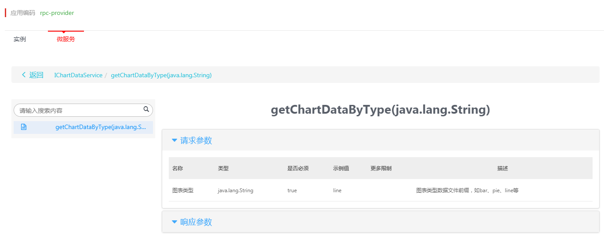
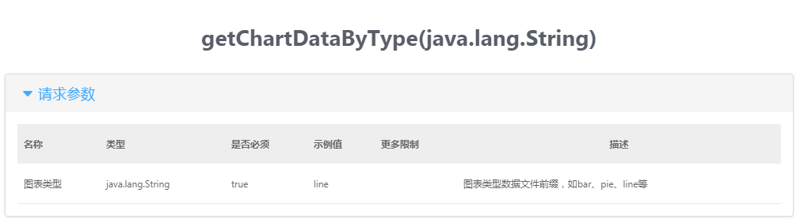
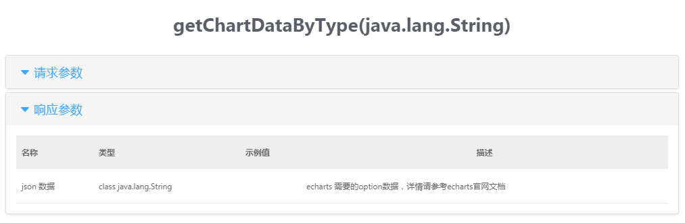

# 整体设计

此文档介绍图表微服务示例的整体开发流程，以实例方式说明微服务治理平台的各种能力。包括应用的分层与创建、服务的配置、接口的声明、服务的注册、服务调用和调试等。

## 应用的创建

### 1.公共SDK工程构建

公共SDK工程中包含对远程服务接口的声明，会依赖服务治理平台的RPC框架的组件，使用其中的注解，其以jar包方式提供，此SDK会被服务调用方和服务提供方依赖。

创建基础maven工程，groupId为com.yonyou.cloud.ms，artifactId为rpc-sdk，打包类型为jar。

	<groupId>com.yonyou.cloud.ms</groupId>
	<artifactId>rpc-sdk</artifactId>
	<packaging>jar</packaging>
	<version>1.0.0</version>

mw.version 为组件版本，如3.0.1-SNAPSHOT或者3.0.1-RELEASE。

### 2.客户端工程构建

客户端工程提供前端图表展示页面，提供RestFul格式的服务获取图表需要的数据，其依赖公共的SDK，通过远程RPC调用服务获取具体数据，返回到前端进行展示。

创建基础maven工程，groupId为com.yonyou.cloud.ms，artifactId为rpc-client，打包类型为war。

	<groupId>com.yonyou.cloud.ms</groupId>
	<artifactId>rpc-client</artifactId>
	<packaging>war</packaging>
	<version>1.0.0</version>

### 3.服务提供方工程构建

服务提供者工程依赖公共的SDK，提供远程服务的实现，获取真正的图表展示数据返给给调用方。

创建基础maven工程，groupId为com.yonyou.cloud.ms，artifactId为rpc-provider，打包类型为war，

	<groupId>com.yonyou.cloud.ms</groupId>
	<artifactId>rpc-provider</artifactId>
	<packaging>war</packaging>
	<version>1.0.0</version>

## 应用配置

微服务治理平台RPC框架的配置包括属性配置文件、spring配置文件、pom.xml组件依赖关系等。

### 1.组件依赖配置

服务治理平台的RPC框架的组件以maven组件的方式提供，业务开发者需要在maven工程的pom.xml中添加对框架的依赖。

- SDK

在pom.xml中添加对治理平台RPC框架的依赖如下：

	<dependency>
		<groupId>com.yonyou.cloud.middleware</groupId>
		<artifactId>middleware</artifactId>
		<version>${mw.version}</version>
	</dependency>

- 调用方

在pom.xml中添加对治理平台RPC框架的依赖如下：

	<dependency>
		<groupId>com.yonyou.cloud.ms</groupId>
		<artifactId>rpc-sdk</artifactId>
		<version>1.0.0</version>
	</dependency>
	<dependency>
		<groupId>com.yonyou.cloud.middleware</groupId>
		<artifactId>middleware</artifactId>
		<version>${mw.version}</version>
	</dependency>
	<dependency>
		<groupId>com.yonyou.cloud.middleware</groupId>
		<artifactId>iris-spring-support</artifactId>
		<version>${mw.version}</version>
	</dependency>
  	<dependency>
	  	<groupId>com.yonyou.cloud.middleware</groupId>
	  	<artifactId>sentinel-spring-support</artifactId>
	  	<version>${mw.version}</version>
  	</dependency>
	
	<dependency>
		<groupId>org.springframework</groupId>
		<artifactId>spring-webmvc</artifactId>
		<version>${spring.version}</version>
	</dependency>

- 提供方

在pom.xml中添加对治理平台RPC框架的依赖如下：

	dependency>
		<groupId>com.yonyou.cloud.ms</groupId>
		<artifactId>rpc-sdk</artifactId>
		<version>1.0.0</version>
	</dependency>
	<dependency>
		<groupId>com.yonyou.cloud.middleware</groupId>
		<artifactId>middleware</artifactId>
		<version>${mw.version}</version>
	</dependency>
	<dependency>
		<groupId>com.yonyou.cloud.middleware</groupId>
		<artifactId>iris-spring-support</artifactId>
		<version>${mw.version}</version>
	</dependency>
  	<dependency>
	  	<groupId>com.yonyou.cloud.middleware</groupId>
	  	<artifactId>sentinel-spring-support</artifactId>
	  	<version>${mw.version}</version>
  	</dependency>

    <dependency>
        <groupId>javax.servlet</groupId>
        <artifactId>javax.servlet-api</artifactId>
        <version>${javax.servlet-api.version}</version>
        <scope>provided</scope>
    </dependency>

rpc-sdk为第一步创建的sdk工程的依赖，其他具体的依赖配置请参考源码工程。

### 2.属性文件配置

- 服务调用方（rpc-client）

application.properties

	#认证需要的ak信息，获取方式请参考用户手册
	access.key=50iZDhyAoXtfguLR
	access.secret=g2MWT3PVMEOiuCo9F6IWjJzEiNEw60
	
	#客户端工程名
	spring.application.name=rpc-client
	spring.profiles.active=dev

- 服务提供方（rpc-provider）

application.properties

	#认证需要的ak信息，获取方式请参考用户手册
	access.key=50iZDhyAoXtfguLR
	access.secret=g2MWT3PVMEOiuCo9F6IWjJzEiNEw60
	
	spring.application.name=rpc-provider
	spring.profiles.active=dev

### 3.Spring配置文件设置

确认rpc-client和rpc-provider中的包扫描路径正确：

	<context:component-scan base-package="com.yonyou.cloud">

## 接口声明和实现

### 1.注解方式声明

在rpc-sdk中定义接口com.yonyou.cloud.ms.service.IChartDataService，并使用注解的方式声明为微服务。

在类名上方添加注解@RemoteCall(AppInfoConstant.APP_INF_SERVER)，其中APP_INF_SERVER为常量，值为：rpc-provider@35568e76-1ef1-4d77-b5cf-8fb66d2c8002，格式为appCode@providerId，appCode和providerId的值可以从界面上获取，详细方式可参考用户手册。

接口代码如下：

	@RemoteCall(AppInfoConstant.APP_INF_SERVER)
	public interface IChartDataService {
		
		/**
		 * 远程获取echart的各种图表的json数据
		 * 
		 * @param type line/pie/bar
		 * @return echarts的json数据
		 */
		public String getChartDataByType(String type) throws Exception;
	}

### 2.接口实现

在服务提供方工程rpc-provider添加接口的实现类，完成实现逻辑，代码如下：
	
	@Service
	public class ChartDataServiceImpl implements IChartDataService {
	
		@Override
		public String getChartDataByType(String type) throws Exception {
			String ctxPath = CustomServletContextListener.CTX_REAL_PATH;
			String json = FileUtils.readFileToString(new File(ctxPath + File.separator + "data" + File.separator + type + ".json"),"utf-8");
			return json;
		}
	    
	}

在工程的src/main/webapp下创建data目录，存储图表需要的json数据，此示例只模拟数据，不对数据库操作做过多介绍。在data目录下放置饼图、柱状图、折线图所需要的json数据文件，具体数据请参考源码工程。

## 服务调用、调试

### 1.客户端开发

- 前台界面开发

编写前端图表展示界面和js控制逻辑，ajax请求后端数据。

	

	

	

	

- Controller开发

RestFul格式服务，提供ajax请求的url映射，注入后端服务。

	@Autowired
	private MsClientService clientService;
	
	@RequestMapping(value = "/line")
	public String getLineOption(HttpServletRequest request) {
		String json = "";
		try {
			json = clientService.getRemoteChartData("line");
		} catch (Exception e) {
			LOGGER.error("获取line的图表初始化数据失败!", e);
		}
		return json;
	}

- 远程服务注入

直接注入远程服务，使用@Autowired引入。

	@Service
	public class MsClientService {
	
		@Autowired
		private IChartDataService remoteDataService;
		
		public String getRemoteChartData(String type) throws Exception {
			return remoteDataService.getChartDataByType(type);
		}
	}

### 2.服务启动和注册

pom.xml 中配置jetty相关依赖，使用jetty:run 方式启动rpc-provider、rpc-client工程。

服务启动后会看到YonYouCloud的banner，在服务注册中心可以看到注册的实例。

### 3.服务调用、监控

服务的调用方和提供方都启动完成并注册到注册中心后，可以使用浏览器访问URL，进行调用测试，前端html页面中的js会发起ajax请求，请求rpc-client的RestFul服务，rpc-client会调用注入的远程服务的bean，从rpc-provider获取最终数据，返回给前端进行展示。url为http://ip：port/rpc-client/,效果如下:

访问治理平台门户，可以查看到服务的接口详情和调用情况，具体操作请查看用户使用手册。

## 扩展开发

### 1.配置方式声明远程服务

RPC框架中除了上述文档中时候用@RemoteCall注解声明远程服务外，也提供使用配置方式声明，示例如下：

1：创建接口类
	
	/**
	 * 获取图表类型列表服务 
	 * 此示例不使用RemoteCall注解，使用spring配置文件的方式配置远程的bean
	 * 
	 * @author Administrator
	 */
	public interface IChartTypeService {
		
		/**
		 * 远程获取echart图表类型列表
		 * 
		 * @return echarts的图表类型list
		 */
		public List<String> getChartTypes() throws Exception;
	}

2：在服务的调用方和提供方的spring配置文件中增加如下配置：

	<bean id="chartTypeService" class="com.yonyou.cloud.middleware.rpc.RPCBeanFactory">
	    <constructor-arg value="${remote.server.name}"></constructor-arg>
	    <constructor-arg value="${remote.server.providerid}"></constructor-arg>
	    <constructor-arg>
	    	<list>
	        	<value>com.yonyou.cloud.ms.service.IChartTypeService</value>
	        </list>
	    </constructor-arg>
	</bean>

3：在调用方@Autowired方式注入远程bean调用

	@Autowired
	private IChartTypeService remoteTypeService;

### 2.指定IP的服务调用

在团队开发时，多个开发者同时启动多个服务实例，调用方在联调时可以指定某个接口调用到指定IP的服务提供方，方便联调和排查具体问题。

1：在服务调用方的application.properties中增加配置如下：

	#针对指定IP调用的额配置，默认配置未false
	client.usemock=true

2：增加mock.properties,并添加接口的ip端口映射关系：

	#此处为配置特殊服务调用到指定的IP端口，可配置多项
	rpc-provider@35568e76-1ef1-4d77-b5cf-8fb66d2c8002@dev=172.20.7.32:8082

### 3.接口文档的生成

在接口声明时，可以在接口的方法、传入参数、返回参数上增加相应的注解，设置说明信息，此信息会展示在微服务控制台中，更清晰的方式展示接口的api文档。

代码示例如下：

	@ApiOperation("根据类型获取各种echarts图表的数据")
	public @ApiReturnValue(name="json 数据", description="echarts 需要的option数据，详情请参考echarts官网文档") String getChartDataByType(@ApiParam(name="图表类型", required=true, description="图表类型数据文件前缀，如bar、pie、line等", exampleValue="line") String type) throws Exception;

@ApiOperation、@ApiReturnValue、@ApiParam等注解的使用说明，请参考使用手册。

展示效果如下：

