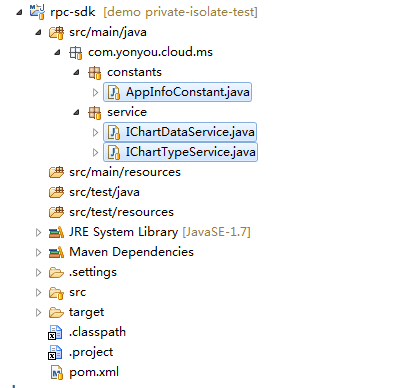
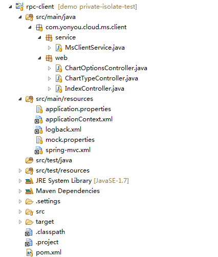
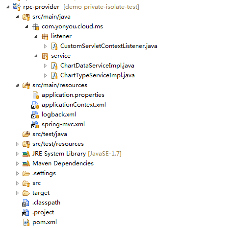
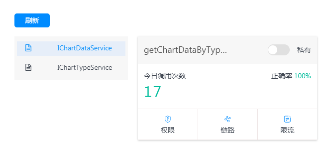

# 使用说明

开发指南中的示例以maven工程方式提供，使用者需要配置maven环境，使用maven的命令即可打包运行，同时可以将示例导入到IDE中，使用IDE进行后续的开发和调试。

## 工程结构说明

整体示例分三个工程，rpc-sdk、rpc-client、rpc-provider，后续微服务拆分也建议采用此中分层结构，导入到IDE中，工程结构如下：

rpc-sdk：

rpc-client：

rpc-provider：

## 服务运行方式

业务开发者使用自己的AccessKey、providerId等信息替换示例中的配置和注解后，可以在本地运行此示例，可以以-D参数的方式覆盖服务注册中心地址，如针对如下项mic_registry=http://172.20.28.31:8080进行覆盖。

1：进入到rpc-sdk目录，执行mvn install命令，安装rpc-sdk到本地，如果下载的盘中已有此组件包，忽略此步骤；
2：进入到rpc-provider目录，运行命令mvn jetty:run,同时也可加入-D运行参数；
3：进入到rpc-client目录，同上运行命令mvn jetty:run；

## 服务调用、效果展示

运行后，以使用浏览器访问URL，进行调用测试：

可以在门户控制台查看调用情况：

